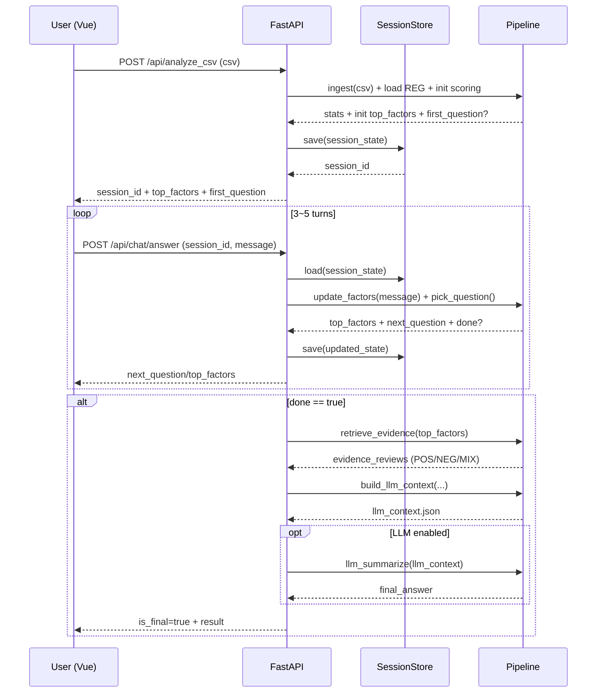

# 아키텍처 (Architecture) — ReviewLens

이 문서는 ReviewLens의 **실제 구현을 위한 기술 아키텍처**를 한 곳에 정리합니다.  
목표는 “리뷰를 요약”이 아니라 **후회 요인(REG) 기반으로 근거 리뷰를 추출하고, 3~5턴 대화로 factor에 수렴한 뒤, 마지막 1회만 LLM을 호출**하는 것입니다.

---
## ✅ 현재 구현 상태 (2025-12-26)

### MVP 완료
- ✅ **Pipeline 모듈화**: ingest, reg_store, sensor, retrieval, dialogue, prompt_builder
- ✅ **FastAPI 백엔드**: API endpoints, session management, schemas
- ✅ **3-5턴 대화 엔진**: DialogueSession 클래스 구현
  - dialogue_history 자동 추적
  - calculation_info 생성 (프론트엔드용)
  - 타임스탬프 기반 파일 저장 (llm_context_demo.{timestamp}.json, prompt_demo.{timestamp}.txt)
  - Safety rules 포함
- ✅ **Factor 확장**: category, display_name 속성 추가
- ✅ **리뷰 라벨링**: POS/NEG/MIX/NEU 분류
- ✅ **LLM 프롬프트 자동 생성**: 대화 내용, 요인, 리뷰 증거 포함
- ✅ **테스트 통과**: pytest 시나리오 검증 완료 (test_demo_scenario.py, test_demo_5turns_full.py)
- ✅ **Frontend (Vue.js)**: 챗봇 UI, 모바일 반응형 디자인
  - 실시간 후회 요인 뱃지
  - 분석 결과 섹션 (계산 공식, 누적 점수)
  - 대화 히스토리 유지
- ✅ **CLI 도구**: 독립 실행 가능한 파이프라인 테스트 도구

### 진행 중
- 🚧 LLM API 통합 (OpenAI/Claude)

### 계획
- 📋 Production 배포
- 📋 Database persistence (Redis/PostgreSQL)
- 📋 URL 기반 리뷰 수집 (Crawler Adapter)

---
## 1. 시스템 개요

### 핵심 구성요소
- **Frontend (Vue.js)**: 챗봇 UI/UX, 대화 흐름 제어, 상태 시각화
- **API Server (FastAPI)**: 프런트엔드 ↔ 백엔드 인터페이스, 세션/파이프라인 오케스트레이션
- **Collector (수집)**: 상품 URL → 리뷰 원문 수집 (MVP에서는 CSV 업로드)
- **Ingest (정제)**: normalize + exact dedup + 통계
- **REG Store (지식/규칙)**: `reg_factor.csv`, `reg_question.csv` (PM 관리)
- **Review Sensor (분석)**: factor scoring + POS/NEG/MIX 라벨링 + evidence 추출
- **Dialogue Engine (대화)**: 3~5턴 질문으로 사용자 조건 수렴
- **Prompt Builder (컨텍스트 생성)**: LLM 호출 직전 JSON 생성
- **LLM Summarizer (옵션)**: 최종 요약 1회 호출

---

## 2. Frontend (Vue.js) 아키텍처

### 역할
- 사용자가 **상품 링크/CSV 업로드**
- 챗봇 대화 UI 제공 (3~5턴)
- 각 턴마다:
  - 챗봇 질문 표시
  - 사용자 입력/선택 수집
  - 상위 Regret Factor 간단 시각화(뱃지/아이콘)
- 최종 단계:
  - “후회 포인트 요약”
  - POS / NEG / MIX 근거 리뷰 요약 카드 표시

### 구현된 기술 스택
- ✅ Vue 3.3.4 + Composition API
- ✅ Vite 5.x
- ✅ Axios 1.6.0 (API 통신)
- ✅ 모바일 반응형 CSS (미디어 쿼리)

### 구현된 컴포넌트
```
frontend/src/components/ChatBot.vue
- 대화 메시지 영역 (스크롤 가능)
- 실시간 후회 요인 뱃지 표시
- 분석 결과 섹션:
  - 계산 공식 (scoring_formula, rating_multiplier_formula)
  - 누적 점수 그리드 (전체 요인)
  - Top factor 하이라이트
- 모바일 반응형 (768px, 480px breakpoint)
```

### 주요 화면
1) 상품 입력(링크/CSV) → 2) 챗봇 대화(3~5턴) → 3) 결과(후회요인+근거)

### Frontend 상태 모델(예시)
```ts
interface ChatState {
  sessionId: string
  turn: number
  messages: ChatMessage[]
  topFactors: { factorKey: string; score: number }[]
  isFinal: boolean
  result?: { llmContext?: any; finalAnswer?: any }
}

interface ChatMessage {
  role: 'user' | 'bot'
  text: string
}
```

---

## 3. FastAPI 데이터 파이프라인 구조

FastAPI는 단순 라우터가 아니라, **분리된 파이프라인 모듈들을 오케스트레이션**합니다.  
특히 “대화(3~5턴) → evidence 추출 → LLM 컨텍스트 생성” 흐름을 **세션 단위**로 관리합니다.

### 3.1 백엔드 폴더 구조(권장)
```
backend/
  app/
    main.py                  # FastAPI app 엔트리
    api/
      routes_analyze.py      # /api/analyze_csv
      routes_chat.py         # /api/chat/answer
    core/
      settings.py            # ENV, 설정
      logging.py             # 로깅 공통
    pipeline/
      ingest.py              # normalize/dedup
      reg_store.py           # reg csv 로드/캐시
      sensor.py              # scoring + labeling
      dialogue.py            # 질문 선택/수렴
      retrieval.py           # evidence selection
      prompt_builder.py      # llm_context 생성
      llm_client.py          # (옵션) LLM 호출
    services/
      session_store.py       # 세션 저장(메모리/SQLite/Redis)
    schemas/
      requests.py            # pydantic request models
      responses.py           # pydantic response models
  data/
    reg_factor.csv
    reg_question.csv
  tests/
```

### 3.2 FastAPI 요청 흐름(오케스트레이션)

#### A) 분석 시작: `/api/analyze_csv`
**핵심 역할**
- CSV 업로드 수신
- ingest 수행(정규화/중복제거)
- reg 로드/캐시
- 1차 factor scoring(사용자 질문이 없다면 “전체 hit 상위”로 초기화)
- 세션 생성/저장(session_id 발급)

**반환**
- session_id
- ingest stats
- 초기 top_factors
- 첫 질문(선택)

---

#### B) 대화 진행: `/api/chat/answer`
**핵심 역할**
- user_message 수신
- session 로드
- factor posterior 업데이트
- 다음 질문 선택(중복 질문 스킵)
- 종료 조건 체크(3~5턴/안정화)

**종료 시**
- evidence retrieval(top factors 기반)
- llm_context 생성
- (옵션) LLM 1회 호출 후 final_answer 생성

---

### 3.3 FastAPI 파이프라인 시퀀스 다이어그램



---

## 4. Frontend ↔ Backend API 연동

### 4.1 POST `/api/analyze_csv`
- CSV 업로드 + 세션 생성
- Response: `session_id`, `stats`, `top_factors`, `question?`

### 4.2 POST `/api/chat/answer`
- 대화 턴 진행
- Response(중간): `is_final=false`, `top_factors`, `question`
- Response(최종): `is_final=true`, `llm_context`, `(옵션) final_answer`

---

## 5. 로깅/모니터링 포인트 (MVP)

### 로그 이벤트(필수)
- `ingest.started`, `ingest.finished`
- `dedup.exact.removed_count`
- `sensor.factor_scored` (top factors, hit counts)
- `dialogue.turn` (turn, selected_question_id, top_factors)
- `retrieval.evidence_selected` (factor_key, n, labels)
- `llm.called` (model, tokens_prompt, tokens_output, latency_ms)
- `llm.skipped` (rule-based response case)

### 메트릭(권장)
- p50/p95 latency (ingest/sensor/dialogue/llm)
- LLM 호출율(%)
- turn 평균(목표 3~5)
- evidence 평균 개수(목표 8~24)

---

## 6. 테스트 전략 (시나리오 기반)
- `tests/test_demo_scenario.py`
  - 3~5턴 대화 시나리오 재현
  - top factor 수렴(assert)
  - 최종 턴에 `llm_context` 생성(assert)
  - `out/llm_context_demo.json` 생성 확인

---

## 7. 기술 스택 제안 (현실 MVP)
- Python 3.11
- FastAPI + Uvicorn
- pandas (CSV ingest)
- pytest (시나리오 테스트)
- (옵션) SQLite (세션 저장), Redis(세션 캐시)
- (옵션) OpenAI/Claude 등 LLM API (최종 1회 요약)

---

## 7. 현재 구현된 기술 스택 (MVP)

### Backend
- **Python 3.9+**
- **FastAPI 0.115.0** + Uvicorn (ASGI server)
- **Pydantic 2.x** (schemas, settings)
- **pandas 2.3.3** (CSV processing)
- **pytest 8.4.2** (testing)

### 구현된 모듈
```python
backend/
├── pipeline/              # 핵심 파이프라인
│   ├── ingest.py         # normalize, dedupe
│   ├── reg_store.py      # REG loading, Factor parsing
│   │                     # Factor: factor_key, anchor_terms, context_terms,
│   │                     #         negation_terms, weight, category, display_name
│   ├── sensor.py         # factor scoring, classification (POS/NEG/MIX/NEU)
│   ├── retrieval.py      # evidence selection (per_factor_limit)
│   ├── dialogue.py       # 3-5 turn conversation engine
│   │                     # DialogueSession:
│   │                     #   - dialogue_history: List[Dict] (role, message)
│   │                     #   - asked_questions: Set (중복 방지)
│   │                     #   - calculation_info: Dict (프론트엔드용)
│   │                     #   - _build_llm_prompt(): 프롬프트 생성
│   │                     #   - 타임스탬프 파일 저장
│   └── prompt_builder.py # LLM context JSON generation
├── app/                  # FastAPI application
│   ├── main.py          # app factory
│   ├── api/
│   │   └── routes_chat.py  # /api/chat/* endpoints
│   │       # POST /api/chat/start
│   │       # POST /api/chat/message
│   ├── services/
│   │   └── session_store.py  # in-memory session
│   ├── schemas/         # request/response models
│   └── core/
│       └── settings.py  # configuration
├── data/                 # 데이터 파일
│   ├── factor/
│   │   ├── reg_factor.csv
│   │   └── reg_question.csv
│   └── review/
│       └── review_sample.csv
├── out/                  # 출력 파일
│   ├── llm_context_demo.{timestamp}.json
│   └── prompt_demo.{timestamp}.txt
└── regret_bot.py        # CLI tool
```

### API Endpoints
- `POST /api/chat/start` → session_id 생성
- `POST /api/chat/message` → 대화 턴 처리, LLM context 반환

### 실행 방법
```bash
# 테스트
python -m pytest tests/test_demo_scenario.py -v

# CLI
python -m backend.regret_bot

# API 서버
uvicorn backend.app.main:app --reload
# http://localhost:8000/docs
```

---

## 8. 입력 채널: CSV 업로드 / 상품(리뷰) URL 입력

초기 ReviewLens의 리뷰 분석 타겟은 다음 2가지 입력 경로를 공식 지원합니다.

### 8.1 CSV 업로드 모드 (MVP/데모 우선)
**목적**
- MVP/데모에서 가장 빠르고 안정적인 데이터 입력
- 크롤링 이슈(차단/속도/정책/구조 변경) 회피

**요구 포맷**
- 권장 컬럼: `review_id, rating, text, created_at`
- 최소 필수: `review_id, rating, text`

**장점**
- 구현 난이도 낮음
- 테스트/재현 용이(같은 CSV로 반복 시연 가능)
- 파이프라인 성능/품질 측정이 쉬움

---

### 8.2 상품(리뷰) URL 입력 모드 (실서비스 경험)
**목적**
- 실제 서비스 경험: “링크 붙여넣기 → 분석”
- 쇼핑몰별 수집 로직을 **어댑터(Adapter)** 로 분리해 확장

**핵심 설계 원칙**
- URL로 수집하든 CSV로 받든 **파이프라인 입구는 동일한 표준 스키마**로 통일합니다.
- `CrawlerFactory`를 두고 vendor별 adapter를 주입합니다.  
  예: `CoupangAdapter`, `NaverSmartStoreAdapter`, `11stAdapter` …

**표준 변환 스키마(권장)**
```json
{
  "reviews": [
    {"review_id":"...", "rating":5, "text":"...", "created_at":"..."}
  ],
  "source": {"type":"url", "vendor":"coupang", "product_url":"..."}
}
```

**리스크**
- 크롤링 병목(BeautifulSoup/DOM 로딩), 차단, 정책 변화
- 페이지 구조 변경 대응 필요

**MVP 운영 전략(현실적인 우회)**
- URL 입력은 “즉시 분석”이 아니라 다음 단계를 거쳐 표준 스키마로 변환 후 동일 파이프라인에 투입합니다.
  1) URL 제출 → 2) 서버 수집/파싱 → 3) 표준 리뷰 레코드로 변환 → 4) ingest/센서/대화 파이프라인
- 초기에는 “지원 쇼핑몰 1개(예: 쿠팡)만” 빠르게 지원하고, 미지원 vendor는 **CSV 업로드로 자연스럽게 fallback**합니다.

---

### 8.3 FastAPI 엔드포인트(입력 채널 반영) 제안

- **POST** `/api/analyze/csv`  
  - multipart 업로드(리뷰 CSV)
  - session 생성 및 초기 top_factors/첫 질문 반환

- **POST** `/api/analyze/url`  
  - body: `{ "product_url": "...", "limit": 300 }`
  - vendor 판별 → adapter 수집/변환 → session 생성 및 초기 top_factors/첫 질문 반환

- **POST** `/api/chat/answer`  
  - session 기반 3~5턴 대화 진행(공통)

---

### 8.4 Vue.js UX 제안(입력 채널)

- 첫 화면에서 입력 방식 **탭 2개**:
  - **[CSV 업로드]** (추천/안정)  
  - **[URL 입력]** (지원 쇼핑몰 표시 + 미지원 시 CSV 안내)
- URL 입력 모드에서는:
  - 지원 vendor 배지 표시
  - 수집 실패/차단 시: “CSV 업로드 안내 + 템플릿 다운로드”로 전환


## 부록: 전체 레포 구조 예시
```
frontend/   # Vue 3
backend/    # FastAPI
docs/
out/
```
