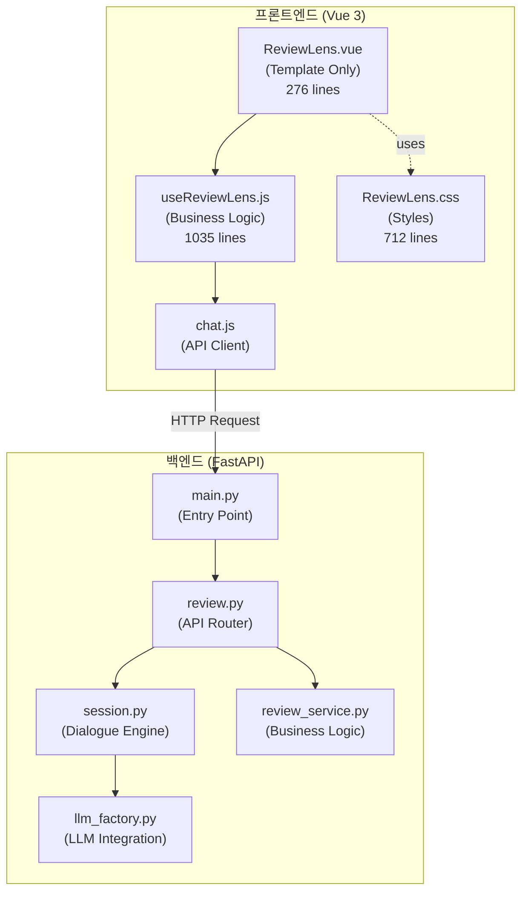
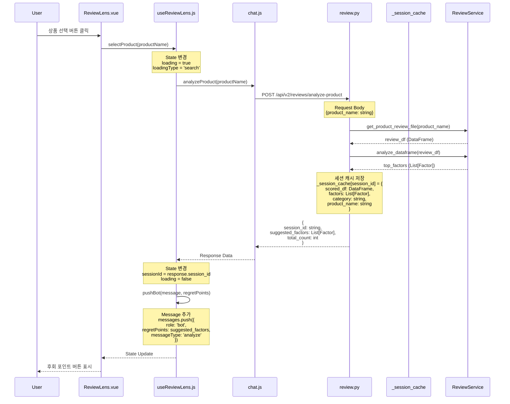
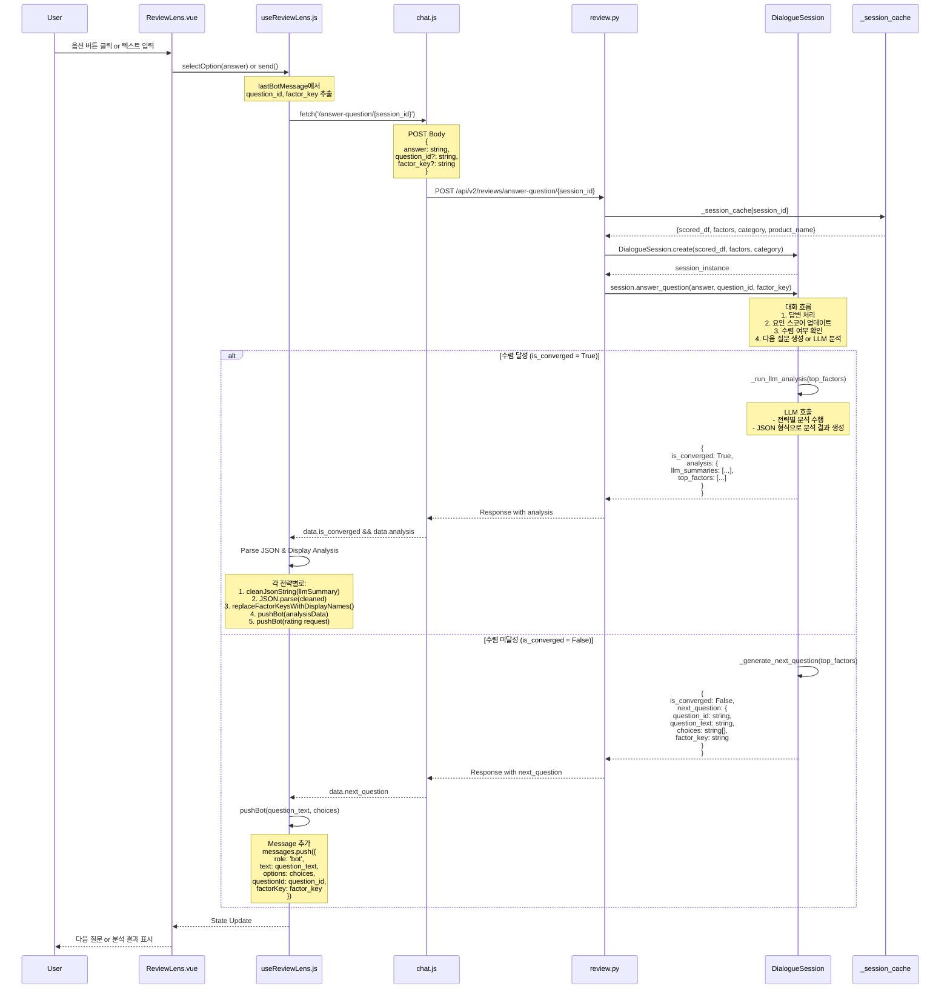
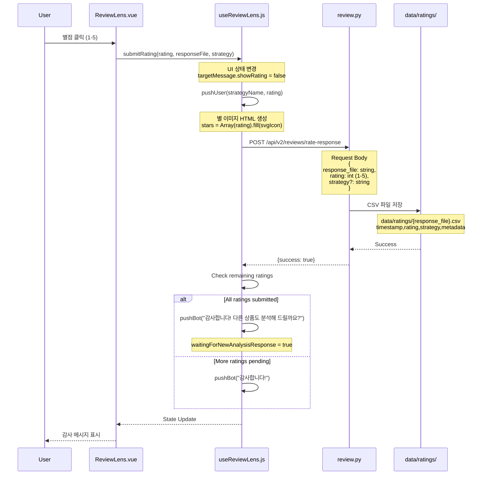
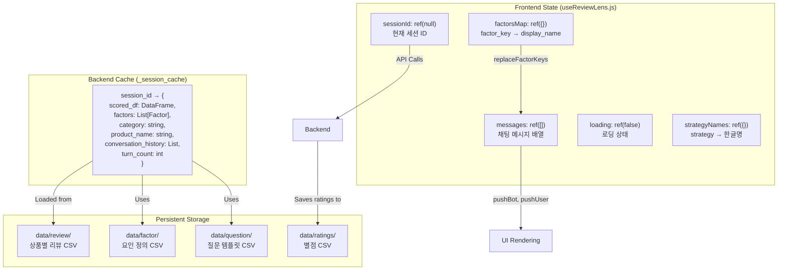

# ReviewLens 챗봇 프로세스 흐름도

## 전체 아키텍처



## 1. 상품 선택 및 분석 시작



### 주요 변수 및 함수

#### Frontend (useReviewLens.js)
```javascript
// State
const sessionId = ref(null)
const messages = ref([])
const loading = ref(false)
const loadingType = ref('search')
const availableProducts = ref([])

// Functions
selectProduct(productName) {
  // 1. 사용자 메시지 추가
  pushUser(productName)
  
  // 2. 로딩 상태 설정
  loading.value = true
  loadingType.value = 'search'
  
  // 3. API 호출
  const res = await analyzeProduct(productName)
  
  // 4. 세션 ID 저장
  sessionId.value = res.session_id
  
  // 5. 후회 포인트 표시
  pushBot(message, null, res.suggested_factors, null, 'analyze')
}
```

#### Backend (review.py)
```python
# Cache
_session_cache: dict = {}  # {session_id: session_data}

@router.post("/analyze-product")
async def analyze_product(request: AnalyzeProductRequest):
    # 1. 세션 ID 생성
    session_id = f"session_{uuid4().hex[:8]}"
    
    # 2. 리뷰 파일 로드
    review_df = service.get_product_review_file(product_name)
    
    # 3. 리뷰 분석 (스코어링)
    scored_df = compute_review_factor_scores(review_df, factors)
    
    # 4. 상위 요인 추출
    top_factors = analyze_dataframe(scored_df)
    
    # 5. 세션 캐시 저장
    _session_cache[session_id] = {
        "scored_df": scored_df,
        "factors": factors,
        "category": category,
        "product_name": product_name
    }
    
    return {
        "session_id": session_id,
        "suggested_factors": top_factors,
        "total_count": len(review_df)
    }
```

## 2. 질문 답변 및 대화 진행



### 주요 변수 및 함수

#### Frontend (useReviewLens.js)
```javascript
// 옵션 선택 처리
const selectOption = async (opt) => {
  pushUser(opt)
  
  // 이전 봇 메시지에서 메타데이터 추출
  const lastBotMessage = messages.value[messages.value.length - 2]
  const questionId = lastBotMessage?.questionId
  const factorKey = lastBotMessage?.factorKey
  
  // API 호출
  const response = await fetch(
    `/api/v2/reviews/answer-question/${sessionId.value}`,
    {
      method: 'POST',
      body: JSON.stringify({
        answer: opt,
        question_id: questionId,
        factor_key: factorKey
      })
    }
  )
  
  const data = await response.json()
  
  // 수렴 여부에 따른 분기 처리
  if (data.is_converged && data.analysis) {
    // 분석 결과 표시
    handleAnalysisResult(data.analysis)
  } else if (data.next_question) {
    // 다음 질문 표시
    pushBot(
      data.next_question.question_text,
      data.next_question.choices,
      null, null, null, null,
      data.next_question.question_id,
      data.next_question.factor_key
    )
  }
}

// Factor key를 display name으로 변환
const replaceFactorKeysWithDisplayNames = (analysisJson) => {
  if (analysisJson.key_findings && Array.isArray(analysisJson.key_findings)) {
    analysisJson.key_findings.forEach(finding => {
      if (finding.factor_key && factorsMap.value[finding.factor_key]) {
        finding.factor = factorsMap.value[finding.factor_key]
      }
    })
  }
  return analysisJson
}
```

#### Backend (review.py)
```python
@router.post("/answer-question/{session_id}")
async def answer_question(
    session_id: str,
    request: AnswerQuestionRequest
):
    # 1. 세션 데이터 가져오기
    session_data = _session_cache.get(session_id)
    if not session_data:
        raise HTTPException(status_code=404, detail="Session not found")
    
    # 2. DialogueSession 생성
    session = DialogueSession.create(
        scored_df=session_data["scored_df"],
        factors=session_data["factors"],
        category=session_data.get("category", "전자기기"),
        product_name=session_data.get("product_name", "제품")
    )
    
    # 3. 대화 기록 복원 (있다면)
    if "conversation_history" in session_data:
        session.conversation_history = session_data["conversation_history"]
        session.turn_count = session_data.get("turn_count", 0)
    
    # 4. 질문 답변 처리
    result = session.answer_question(
        answer=request.answer,
        question_id=request.question_id,
        factor_key=request.factor_key
    )
    
    # 5. 대화 상태 저장
    session_data["conversation_history"] = session.conversation_history
    session_data["turn_count"] = session.turn_count
    
    # 6. 응답 생성
    if result["is_converged"]:
        # 수렴 달성 - LLM 분석 결과 반환
        return AnswerQuestionResponse(
            is_converged=True,
            analysis=result["analysis"]
        )
    else:
        # 다음 질문 반환
        return AnswerQuestionResponse(
            is_converged=False,
            next_question=result["next_question"]
        )
```

#### Backend (session.py - DialogueSession)
```python
class DialogueSession:
    """대화 세션 관리"""
    
    def __init__(
        self,
        scored_df: pd.DataFrame,
        factors: List[Factor],
        questions: List[Question],
        category: str = "전자기기",
        product_name: str = "제품"
    ):
        self.scored_df = scored_df
        self.factors = factors
        self.questions = questions
        self.category = category
        self.product_name = product_name
        self.conversation_history = []
        self.turn_count = 0
        self.factor_scores = {}  # {factor_key: score}
        self.user_preferences = {}  # {factor_key: preference}
    
    def answer_question(
        self,
        answer: str,
        question_id: Optional[str] = None,
        factor_key: Optional[str] = None
    ) -> Dict:
        """질문에 대한 답변 처리"""
        
        # 1. 답변 기록
        self.conversation_history.append({
            "turn": self.turn_count,
            "question_id": question_id,
            "factor_key": factor_key,
            "answer": answer,
            "timestamp": datetime.now().isoformat()
        })
        self.turn_count += 1
        
        # 2. Factor 스코어 업데이트
        if factor_key:
            self._update_factor_score(factor_key, answer)
        
        # 3. 수렴 여부 확인
        is_converged = self._check_convergence()
        
        if is_converged:
            # 4a. 수렴 달성 - LLM 분석 실행
            top_factors = self._get_top_factors(limit=5)
            analysis_result = self._run_llm_analysis(top_factors)
            
            return {
                "is_converged": True,
                "analysis": analysis_result
            }
        else:
            # 4b. 다음 질문 생성
            next_question = self._generate_next_question()
            
            return {
                "is_converged": False,
                "next_question": next_question
            }
    
    def _check_convergence(self) -> bool:
        """수렴 조건 확인"""
        # 조건 1: 최소 3턴 진행
        if self.turn_count < 3:
            return False
        
        # 조건 2: 상위 요인들의 스코어 차이가 충분히 큼
        top_factors = self._get_top_factors(limit=5)
        if len(top_factors) >= 3:
            # 상위 3개 요인의 평균 스코어와 나머지의 차이 확인
            top_3_avg = sum(f[1] for f in top_factors[:3]) / 3
            others_avg = sum(f[1] for f in top_factors[3:]) / max(len(top_factors) - 3, 1)
            
            if top_3_avg - others_avg > 0.3:  # 임계값
                return True
        
        # 조건 3: 최대 5턴 도달
        if self.turn_count >= 5:
            return True
        
        return False
    
    def _run_llm_analysis(self, top_factors: List[Tuple[str, float]]) -> Dict:
        """LLM 기반 분석 실행"""
        
        # 1. Evidence 리뷰 수집
        evidence_reviews = []
        for factor_key, score in top_factors:
            reviews = retrieve_evidence_reviews(
                self.scored_df,
                factor_key,
                limit=5
            )
            evidence_reviews.extend(reviews)
        
        # 2. LLM 전략별 분석
        llm_summaries = []
        strategies = settings.LLM_STRATEGIES  # ['default', 'concise', 'detailed', ...]
        
        for strategy in strategies:
            llm_client = get_llm_client(strategy)
            
            # 프롬프트 구성
            prompt = self._build_analysis_prompt(
                top_factors,
                evidence_reviews,
                strategy
            )
            
            # LLM 호출
            llm_response = llm_client.generate(prompt)
            
            llm_summaries.append({
                "strategy": strategy,
                "summary": llm_response,
                "response_file": f"llm_{strategy}_{self.turn_count}.json"
            })
        
        # 3. 응답 구성
        return {
            "product_name": self.product_name,
            "llm_summaries": llm_summaries,
            "llm_summary": llm_summaries[0]["summary"] if llm_summaries else None,
            "top_factors": [
                {
                    "factor_key": fk,
                    "display_name": self._get_factor_display_name(fk),
                    "score": score
                }
                for fk, score in top_factors
            ],
            "response_file": llm_summaries[0]["response_file"] if llm_summaries else None
        }
```

## 3. 별점 제출



### 주요 변수 및 함수

#### Frontend (useReviewLens.js)
```javascript
const submitRating = async (rating, responseFile, strategy = null) => {
  // 1. 해당 responseFile의 별점 UI만 숨기기
  const targetMessage = messages.value.find(m => 
    m.role === 'bot' && m.showRating && m.responseFile === responseFile
  )
  if (targetMessage) {
    targetMessage.showRating = false
  }
  
  // 2. 전략명 한글로 변환
  const strategyToSend = strategy || targetMessage?.strategy
  let ratingText = ''
  if (strategyToSend) {
    const strategyNameKo = getStrategyNameInKorean(strategyToSend)
    ratingText = `${strategyNameKo} 분석`
  }
  
  // 3. 사용자 메시지에 별점 표시
  pushUser(ratingText, rating)
  
  // 4. 백엔드에 별점 전송
  const payload = {
    response_file: responseFile,
    rating: rating
  }
  if (strategyToSend) {
    payload.strategy = strategyToSend
  }
  
  const response = await fetch('/api/v2/reviews/rate-response', {
    method: 'POST',
    headers: { 'Content-Type': 'application/json' },
    body: JSON.stringify(payload)
  })
  
  // 5. 남은 별점 확인
  const remainingRatings = messages.value.filter(m => m.showRating).length
  
  if (remainingRatings === 0) {
    // 모든 별점 완료
    pushBot('소중한 의견 감사합니다!<br/>다른 상품도 분석해 드릴까요?')
    waitingForNewAnalysisResponse.value = true
  } else {
    pushBot('감사합니다!')
  }
}
```

#### Backend (review.py)
```python
@router.post("/rate-response", response_model=RateResponseResponse)
async def rate_response(request: RateResponseRequest):
    """분석 결과에 대한 별점 저장"""
    
    # 1. 별점 데이터 구성
    rating_data = {
        "timestamp": datetime.now().isoformat(),
        "response_file": request.response_file,
        "rating": request.rating,
        "strategy": request.strategy or "default",
        "metadata": {}
    }
    
    # 2. CSV 파일로 저장
    ratings_dir = get_data_dir() / "ratings"
    ratings_dir.mkdir(parents=True, exist_ok=True)
    
    rating_file = ratings_dir / f"{request.response_file}.csv"
    
    df = pd.DataFrame([rating_data])
    if rating_file.exists():
        # 기존 파일에 추가
        existing_df = pd.read_csv(rating_file)
        df = pd.concat([existing_df, df], ignore_index=True)
    
    df.to_csv(rating_file, index=False)
    
    return RateResponseResponse(
        success=True,
        message="Rating saved successfully"
    )
```

## 4. 상태 관리 및 데이터 흐름



## 5. 주요 데이터 구조

### Frontend Message Object
```typescript
interface Message {
  role: 'user' | 'bot'
  text?: string
  timestamp: string
  
  // Bot Message 전용
  options?: string[]              // 선택지 버튼
  regretPoints?: Factor[]         // 후회 포인트 버튼
  reviews?: Review[]              // 근거 리뷰
  messageType?: 'analyze' | 'error' | 'alert' | 'search'
  analysisData?: AnalysisResult   // 분석 결과 JSON
  
  // 질문 메타데이터
  questionId?: string
  factorKey?: string
  
  // 별점 UI
  showRating?: boolean
  responseFile?: string
  strategy?: string
  hoverRating?: number
}

interface AnalysisResult {
  productName: string
  strategyName?: string
  summary: string
  key_findings: KeyFinding[]
  balanced_view: BalancedView
  decision_rule: DecisionRule
  final_recommendation: string
  one_line_tip: string
}

interface KeyFinding {
  factor: string              // display_name으로 교체됨
  factor_key?: string
  risk_level: 'high' | 'mid' | 'low'
  what_users_say: string
}
```

### Backend Session Data
```python
# _session_cache structure
{
    "session_abc123": {
        "scored_df": pd.DataFrame,  # 리뷰 + 스코어
        "factors": [Factor(...)],   # 요인 리스트
        "category": "전자기기",
        "product_name": "커피머신",
        "conversation_history": [
            {
                "turn": 0,
                "question_id": "q_001",
                "factor_key": "noise",
                "answer": "예",
                "timestamp": "2026-01-18T10:30:00"
            },
            # ...
        ],
        "turn_count": 3,
        "factor_scores": {
            "noise": 0.85,
            "taste": 0.72,
            # ...
        }
    }
}
```

### Factor & Question Objects
```python
@dataclass
class Factor:
    """요인 정의"""
    factor_key: str          # "noise"
    display_name: str        # "소음/시끄러움"
    category: str            # "전자기기"
    anchor_terms: List[str]  # ["시끄럽", "소음", "조용"]
    weight: float = 1.0

@dataclass
class Question:
    """질문 템플릿"""
    question_id: str         # "q_noise_001"
    factor_key: str          # "noise"
    question_text: str       # "소음이 신경쓰이시나요?"
    answer_type: str         # "single_choice"
    choices: str             # "예|아니오|잘 모르겠음"
    category: str            # "전자기기"
```

## 6. 핵심 함수 호출 체인

### 상품 분석 시작
```
User Click
  ↓
UI: @click="selectProduct(product)"
  ↓
useReviewLens.js: selectProduct(productName)
  ↓
chat.js: analyzeProduct(productName)
  ↓
review.py: POST /analyze-product
  ↓
ReviewService.get_product_review_file(product_name)
  ↓
compute_review_factor_scores(review_df, factors)
  ↓
_session_cache[session_id] = {...}
  ↓
Response: {session_id, suggested_factors, total_count}
  ↓
useReviewLens.js: pushBot(message, regretPoints)
  ↓
UI: Render regret point buttons
```

### 질문 답변 및 수렴
```
User Click Option
  ↓
UI: @click="selectOption(opt)"
  ↓
useReviewLens.js: selectOption(opt)
  ↓
fetch('/answer-question/{session_id}', {answer, question_id, factor_key})
  ↓
review.py: POST /answer-question/{session_id}
  ↓
DialogueSession.answer_question(answer, question_id, factor_key)
  ↓
  ├─ _update_factor_score(factor_key, answer)
  ├─ _check_convergence()
  └─ if converged:
        _run_llm_analysis(top_factors)
          ↓
          retrieve_evidence_reviews(scored_df, factor_key)
          ↓
          get_llm_client(strategy).generate(prompt)
          ↓
          return {llm_summaries, top_factors}
     else:
        _generate_next_question()
          ↓
          return {next_question}
  ↓
Response: {is_converged, analysis OR next_question}
  ↓
useReviewLens.js: 
  if (is_converged) {
    cleanJsonString() → JSON.parse() → replaceFactorKeysWithDisplayNames()
    → pushBot(analysisData) → pushBot(rating request)
  } else {
    pushBot(question_text, choices, questionId, factorKey)
  }
  ↓
UI: Render analysis OR next question
```

### 별점 제출
```
User Click Star
  ↓
UI: @click="submitRating(rating, responseFile, strategy)"
  ↓
useReviewLens.js: submitRating(rating, responseFile, strategy)
  ↓
targetMessage.showRating = false
  ↓
pushUser(strategyName, rating)
  ↓
fetch('/rate-response', {response_file, rating, strategy})
  ↓
review.py: POST /rate-response
  ↓
Save to CSV: data/ratings/{response_file}.csv
  ↓
Response: {success: true}
  ↓
useReviewLens.js: 
  remainingRatings = messages.filter(m => m.showRating).length
  if (remainingRatings === 0) {
    pushBot("다른 상품도 분석해 드릴까요?")
    waitingForNewAnalysisResponse = true
  }
  ↓
UI: Show thank you message
```

## 7. 파일별 주요 책임

| 파일 | 라인 수 | 주요 책임 |
|------|---------|----------|
| **Frontend** |
| ReviewLens.vue | 276 | 템플릿 렌더링, 사용자 인터랙션 |
| useReviewLens.js | 1035 | 상태 관리, 비즈니스 로직, API 호출 |
| ReviewLens.css | 712 | 스타일 정의 |
| chat.js | 166 | API 클라이언트, HTTP 요청 |
| **Backend** |
| main.py | - | FastAPI 앱 초기화, 라우터 등록 |
| review.py | 1143 | API 엔드포인트, 요청/응답 처리 |
| session.py | 928 | 대화 엔진, 수렴 로직, LLM 호출 |
| review_service.py | - | 리뷰 파일 로드, 분석 로직 |
| llm_factory.py | - | LLM 클라이언트 생성, 전략별 분기 |
| scoring.py | - | 리뷰-요인 스코어링 알고리즘 |
| retrieval.py | - | 근거 리뷰 검색 |

## 8. 성능 최적화 포인트

1. **세션 캐싱** (_session_cache)
   - 메모리 내 세션 데이터 저장으로 DB 조회 최소화
   - scored_df를 캐싱하여 반복 계산 방지

2. **병렬 LLM 호출** (다중 전략)
   - 여러 전략을 순차적으로 호출하므로 병렬화 가능
   - 현재: for loop → 개선: asyncio.gather

3. **프론트엔드 상태 최소화**
   - Composable로 로직 분리하여 재사용성 향상
   - 불필요한 re-render 방지

4. **JSON 직접 렌더링**
   - Markdown 파싱 없이 JSON → Vue Template
   - User Agent Stylesheet 충돌 회피
