# ReviewLens 시스템 아키텍처

ReviewLens는 제품 리뷰를 분석하여 구매 후회 요인을 찾아내는 대화형 AI 시스템입니다.

## 목차

- [전체 시스템 아키텍처](#전체-시스템-아키텍처)
- [데이터 수집 계층](#데이터-수집-계층)
- [분석 파이프라인](#분석-파이프라인)
- [대화 엔진](#대화-엔진)
- [LLM 통합](#llm-통합)
- [모니터링 계층](#모니터링-계층)
- [배포 아키텍처](#배포-아키텍처)

---

## 전체 시스템 아키텍처

```mermaid
graph TB
    subgraph "1️⃣ 데이터 수집 계층"
        A1[스마트스토어<br/>크롤러]
        A2[리뷰 데이터<br/>JSON/CSV]
        A3[Factor 분석기<br/>후회 요인 추출]
        A4[Question 생성기<br/>대화 질문 생성]
        
        A1 -->|크롤링| A2
        A2 -->|분석| A3
        A3 -->|생성| A4
    end
    
    subgraph "2️⃣ 데이터 저장소"
        B1[(reviews.csv<br/>리뷰 원본)]
        B2[(factors.csv<br/>후회 요인)]
        B3[(questions.csv<br/>대화 질문)]
        
        A2 --> B1
        A3 --> B2
        A4 --> B3
    end
    
    subgraph "3️⃣ 백엔드 API Layer"
        C1[FastAPI Server<br/>:8000]
        C2[Metrics Middleware<br/>성능 측정]
        C3[CORS Middleware<br/>보안]
        
        C2 -.-> C1
        C3 -.-> C1
    end
    
    subgraph "4️⃣ 대화 엔진 Core"
        D1[Session Manager<br/>세션 관리]
        D2[Dialogue Engine<br/>대화 수렴 로직]
        D3[Factor Scoring<br/>점수 계산]
        D4[Evidence Retrieval<br/>증거 리뷰 검색]
        
        D1 --> D2
        D2 --> D3
        D3 --> D4
    end
    
    subgraph "5️⃣ LLM 통합 Layer"
        E1{LLM Factory}
        E2[Gemini Client]
        E3[OpenAI Client]
        E4[Claude Client]
        E5[Fallback Handler]
        
        E1 --> E2
        E1 --> E3
        E1 --> E4
        E1 --> E5
    end
    
    subgraph "6️⃣ 프론트엔드"
        F1[Vue.js App<br/>:3000]
        F2[ChatBot Component]
        F3[Analytics Display]
        
        F1 --> F2
        F1 --> F3
    end
    
    subgraph "7️⃣ 모니터링 Stack"
        G1[Prometheus<br/>:9090<br/>메트릭 수집]
        G2[Grafana<br/>:3001<br/>시각화]
        G3[Metrics Registry<br/>Counter/Histogram/Gauge]
        
        G3 -->|scrape| G1
        G1 -->|query| G2
    end
    
    %% 데이터 플로우
    B1 & B2 & B3 --> D1
    D4 --> E1
    E2 & E3 & E4 & E5 --> D2
    
    %% API 통신
    F2 -->|HTTP POST| C1
    C1 --> D1
    D2 -->|응답| C1
    C1 -->|JSON| F2
    
    %% 모니터링
    C2 -->|메트릭| G3
    D2 -->|메트릭| G3
    E1 -->|메트릭| G3
    
    style A3 fill:#e1f5dd
    style D2 fill:#fff4e6
    style E1 fill:#e3f2fd
    style G1 fill:#fce4ec
```

---

## 데이터 수집 계층

### 1. 리뷰 크롤링 및 수집

```mermaid
sequenceDiagram
    participant User
    participant Script as collect_smartstore_reviews.py
    participant Browser as Selenium WebDriver
    participant Web as Smartstore 웹페이지
    participant File as review.json
    participant Analyzer as analyze_product_reviews.py
    participant FactorCSV as factors.csv
    participant QuestionGen as Question Generator
    participant QuestionCSV as questions.csv
    
    User->>Script: python collect_smartstore_reviews.py
    Script->>Browser: Chrome WebDriver 초기화
    Browser->>Web: 페이지 로드 (URL)
    Web-->>Browser: HTML 렌더링
    Browser->>Browser: 리뷰 요소 찾기 (XPath/CSS)
    Browser->>Web: 스크롤/클릭 (다음 페이지)
    Web-->>Browser: 추가 리뷰 로드
    Browser-->>Script: 파싱된 리뷰 데이터
    Script->>File: 저장 (페이지네이션)
    Script-->>User: ✅ 수집 완료
    
    User->>Analyzer: python analyze_product_reviews.py
    Analyzer->>File: 리뷰 로드
    Analyzer->>Analyzer: TF-IDF 분석<br/>키워드 추출<br/>후회 요인 식별
    Analyzer->>FactorCSV: Factor 저장<br/>(anchor/context/negation terms)
    Analyzer-->>User: ✅ 분석 완료
    
    User->>QuestionGen: python update_dialogue.py
    QuestionGen->>FactorCSV: Factor 로드
    QuestionGen->>QuestionGen: 각 Factor별<br/>질문 생성<br/>(우선순위 설정)
    QuestionGen->>QuestionCSV: Question 저장<br/>(factor_id 매핑)
    QuestionGen-->>User: ✅ 질문 생성 완료
```

**주요 컴포넌트**:

- **`scripts/collect_smartstore_reviews.py`**
  - 역할: 네이버 스마트스토어 웹 스크래핑 (Selenium Chrome WebDriver)
  - 기능: 동적 페이지 로딩, 스크롤/클릭 자동화, 페이지네이션, 에러 처리, JSON/CSV 저장
  - 기술: Selenium WebDriver, undetected-chromedriver (선택적), XPath/CSS 선택자
  - 출력: `data/review/reviews_<product>_<timestamp>.json` 또는 `.csv`

- **`scripts/analyze_product_reviews.py`**
  - 역할: 리뷰 텍스트 분석 및 후회 요인 추출
  - 기술: TF-IDF, 키워드 빈도 분석
  - 출력: `data/factor/reg_factor.csv`

- **Factor 구조**:
  ```csv
  factor_id,category,factor_key,display_name,weight,anchor_terms,context_terms,negation_terms
  1,robot_cleaner,noise,소음,1.5,"소음|시끄러|떠들","조용|정숙","조용하|괜찮"
  ```
  - `factor_id`: 고유 식별자
  - `category`: 제품 카테고리 (예: robot_cleaner)
  - `factor_key`: Factor 키 (내부 참조용)
  - `display_name`: 화면 표시 이름
  - `weight`: 가중치 (점수 계산 시 곱셈)
  - `anchor_terms`: 핵심 키워드 (+1.0점)
  - `context_terms`: 연관 키워드 (+0.3점)
  - `negation_terms`: 부정/긍정 반전 표현 (점수 반영 X, `has_neg` 플래그만 설정하여 NEG/MIX/POS 증거 분류에 활용)

- **Question 구조**:
  ```csv
  question_id,factor_id,factor_key,question_text,answer_type,choices,next_factor_hint
  1001,1,water_control,물 양을 직접 조절하고 싶으신가요?,no_choice,,
  1002,1,water_control,커피 시 물 관리가 중요한가요?,single_choice,매우 중요|보통|상관없음,
  ```
  - `question_id`: 질문 고유 식별자
  - `factor_id`: 연결된 후회 요인 ID (factors.csv의 factor_id와 매핑)
  - `factor_key`: 후회 요인 키 (factors.csv의 factor_key와 매핑)
  - `question_text`: 사용자에게 표시되는 질문 텍스트
  - `answer_type`: 답변 유형 (`no_choice`, `single_choice`, `multi_choice` 등)
  - `choices`: 선택지 목록 (파이프 구분자 `|`, no_choice인 경우 빈 값)
  - `next_factor_hint`: 다음 질문 선택 힌트 (선택적)

### 2. 질문 생성

```mermaid
graph LR
    A[Factor CSV] --> B[Question Generator]
    B --> C{질문 유형}
    C -->|우선순위 높음| D[핵심 질문]
    C -->|우선순위 중간| E[확인 질문]
    C -->|우선순위 낮음| F[보조 질문]
    
    D & E & F --> G[questions.csv]
    
    style D fill:#ffcdd2
    style E fill:#fff9c4
    style G fill:#c8e6c9
```

**Question 구조**:
```csv
question_id,factor_id,factor_key,question_text,answer_type,choices,next_factor_hint
1001,1,water_control,물 양을 직접 조절하고 싶으신가요?,no_choice,,
1002,1,water_control,커피 시 물 관리가 중요한가요?,single_choice,매우 중요|보통|상관없음,
```
- `question_id`: 질문 고유 식별자
- `factor_id`: 연결된 후회 요인 ID (factors.csv의 factor_id와 매핑)
- `factor_key`: 후회 요인 키 (factors.csv의 factor_key와 매핑)
- `question_text`: 사용자에게 표시되는 질문 텍스트
- `answer_type`: 답변 유형 (`no_choice`, `single_choice`, `multi_choice` 등)
- `choices`: 선택지 목록 (파이프 구분자 `|`, no_choice인 경우 빈 값)
- `next_factor_hint`: 다음 질문 선택 힌트 (선택적)

---

## 분석 파이프라인

### 1. 세션 초기화 및 데이터 로딩

```mermaid
flowchart TD
    A[사용자 제품 URL 입력] --> B[URL 검증]
    B --> C{해당 제품 리뷰 데이터<br/>이미 존재?}
    
    C -->|Yes| D[캐시된 리뷰 로드<br/>세션 저장소]
    C -->|No| E[크롤링 트리거]
    
    E --> F[Selenium WebDriver 실행]
    F --> G[리뷰 수집 & 세션 저장]
    G --> D
    
    D --> H[DialogueSession 생성]
    H --> I[Category 필터링]
    I --> J[Factor Map 생성]
    J --> K[세션 준비 완료]
    
    K --> L{메트릭 기록}
    L -->|dialogue_sessions_total| M[Prometheus]
    
    style H fill:#e1f5dd
    style L fill:#fce4ec
```

**주요 로직** (`backend/pipeline/dialogue.py`):

```python
class DialogueSession:
    def __init__(self, category, data_dir, reviews_df=None):
        # 1. 데이터 로드
        # - reviews_df: 세션 저장소에서 전달받은 리뷰 (운영)
        # - None: CSV에서 로드 (테스트/개발)
        self.reviews_df = reviews_df
        
        # 2. Factor/Question 파싱
        all_factors = parse_factors(factors_df)
        self.factors = [f for f in all_factors if f.category == category]
        self.questions = parse_questions(questions_df)
        
        # 3. 메트릭 기록
        dialogue_sessions_total.labels(category=category).inc()
```

### 2. 대화 턴 처리 (Factor Convergence)

```mermaid
stateDiagram-v2
    [*] --> ReceiveMessage: 사용자 메시지
    
    ReceiveMessage --> NormalizeText: 텍스트 정규화
    NormalizeText --> MatchFactors: Factor 매칭
    
    MatchFactors --> ScoreCalculation: 점수 계산
    ScoreCalculation --> Top3Extraction: Top 3 추출
    
    Top3Extraction --> ConvergenceCheck: 수렴 체크
    ConvergenceCheck --> Converged: Jaccard > 0.7
    ConvergenceCheck --> NotConverged: Jaccard ≤ 0.7
    
    Converged --> Finalize: 최종 분석
    NotConverged --> NextQuestion: 다음 질문 생성
    
    NextQuestion --> [*]: BotTurn 반환
    Finalize --> EvidenceRetrieval: 증거 수집
    EvidenceRetrieval --> LLMSummary: LLM 요약
    LLMSummary --> [*]: 완료
    
    note right of MatchFactors
        anchor_terms: 1.0점
        context_terms: 0.3점
        weight 곱셈
    end note
    
    note right of ConvergenceCheck
        prev_top3 vs cur_top3
        Jaccard similarity
        3회 연속 안정 시 수렴
    end note
```

**핵심 알고리즘**:

```python
def step(self, user_message: str) -> BotTurn:
    # 1. 정규화 및 매칭
    norm = normalize(user_message)
    for factor in self.factors:
        score = 0
        if any(t in norm for t in factor.anchor_terms):
            score += 1.0
        if any(t in norm for t in factor.context_terms):
            score += 0.3
        
        weighted_score = score * factor.weight
        self.cumulative_scores[factor.factor_key] += weighted_score
    
    # 2. Top 3 추출
    top_factors = self._get_top_factors(top_k=3)
    
    # 3. 수렴 체크 (Jaccard similarity)
    jaccard = _jaccard(self.prev_top3, cur_top3)
    if jaccard > 0.7:
        self.stability_hits += 1
    
    # 4. 수렴 조건: 3회 연속 안정 OR 5턴 경과
    if self.stability_hits >= 3 or self.turn_count >= 5:
        return self._finalize(top_factors)
```

### 3. Evidence Retrieval (증거 리뷰 검색)

```mermaid
graph TB
    A[Top Factors] --> B[Review Scoring]
    B --> C[Label Assignment<br/>NEG/MIX/POS]
    C --> D{Quota System}
    
    D -->|Rank 0<br/>Top 1| E[NEG:3, MIX:2, POS:1]
    D -->|Rank 1<br/>Top 2| F[NEG:2, MIX:2, POS:1]
    D -->|Rank 2<br/>Top 3| G[NEG:2, MIX:2, POS:1]
    
    E & F & G --> H[Evidence Pool]
    H --> I[Max 15개 제한]
    I --> J[최종 Evidence]
    
    style C fill:#fff9c4
    style I fill:#ffcdd2
```

**Label 분류 로직** (`backend/pipeline/retrieval.py`):

```python
def _assign_label(row, factor_key):
    score = row.get(f"score_{factor_key}", 0)
    rating = row.get("rating", 5)
    
    # 1. 점수 기반
    if score >= 2.0 and rating <= 3:
        return "NEG"  # 강한 부정
    elif score >= 1.0 and rating == 4:
        return "MIX"  # 혼재
    elif score >= 1.0 and rating == 5:
        return "POS"  # 긍정
    else:
        return None  # 필터링
```

### 4. Scoring Pipeline

```mermaid
flowchart TD
    A[리뷰 DataFrame] --> B[compute_review_factor_scores]
    
    B --> C[각 리뷰 순회]
    C --> D{Factor 매칭}
    
    D -->|anchor match| E[base_score += 1.0]
    D -->|context match| F[base_score += 0.3]
    D -->|negation match| G["has_neg 플래그 설정 (감점 X)"]
    
    E & F --> H[factor.weight 곱셈]
    H --> I["rating multiplier: 1.0 + (5-rating)*0.2"]
    I --> J[final_score]
    
    J --> K["scored_df에 추가 (score_factor_key 컬럼)"]
    G --> L["has_neg_factor_key 컬럼 추가"]
    
    style H fill:#e1f5dd
    style I fill:#fff4e6
    style K fill:#e3f2fd
    style L fill:#ffe0b2
```

**메트릭 계측**:
```python
with Timer(scoring_duration_seconds, {'category': self.category}):
    self.scored_df, self.factor_counts = compute_review_factor_scores(
        self.reviews_df, 
        self.factors
    )
```

---

## 대화 엔진

### DialogueSession State Machine

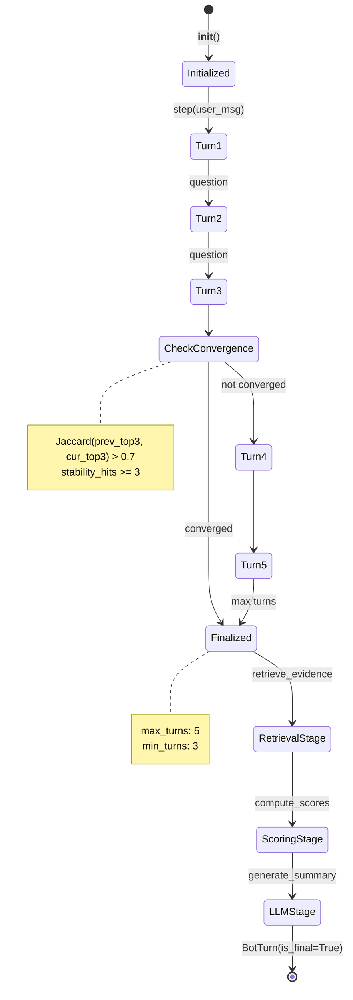

**세션 데이터 구조**:

```python
@dataclass
class BotTurn:
    question_text: Optional[str]        # 다음 질문
    top_factors: List[Tuple[str, float]]  # (factor_key, score)
    is_final: bool                       # 완료 여부
    llm_context: Optional[Dict]          # LLM 응답
    question_id: Optional[str]           # 질문 ID
    answer_type: Optional[str]           # no_choice | single_choice
    choices: Optional[str]               # 선택지
```

---

## LLM 통합

### LLM Factory Pattern

```mermaid
classDiagram
    class BaseLLMClient {
        <<abstract>>
        +generate_summary()
    }
    
    class GeminiClient {
        -api_key: str
        -model: str
        +generate_summary()
        -_build_prompt()
        -_get_fallback_summary()
    }
    
    class OpenAIClient {
        -api_key: str
        -model: str
        +generate_summary()
        -_build_prompts()
        -_get_fallback_summary()
    }
    
    class ClaudeClient {
        -api_key: str
        -model: str
        +generate_summary()
        -_build_prompts()
        -_get_fallback_summary()
    }
    
    class LLMFactory {
        +create_client()
    }
    
    class Settings {
        +LLM_PROVIDER: str
        +GEMINI_API_KEY: str
        +OPENAI_API_KEY: str
        +CLAUDE_MODEL: str
    }
    
    BaseLLMClient <|-- GeminiClient
    BaseLLMClient <|-- OpenAIClient
    BaseLLMClient <|-- ClaudeClient
    LLMFactory ..> BaseLLMClient : creates
    LLMFactory ..> Settings : reads
    
    note for BaseLLMClient "모든 LLM 클라이언트의 공통 인터페이스"
    note for LLMFactory "환경변수 기반 동적 클라이언트 생성"
```

### LLM 호출 플로우

```mermaid
sequenceDiagram
    participant D as DialogueSession
    participant F as LLMFactory
    participant S as Settings
    participant C as LLM Client
    participant API as LLM API
    participant M as Metrics
    
    D->>D: _finalize() 호출
    D->>F: get_llm_client()
    F->>S: LLM_PROVIDER 조회
    S-->>F: "openai"
    F->>F: create_client("openai")
    F-->>D: OpenAIClient
    
    D->>M: Timer 시작
    D->>C: generate_summary(top_factors, evidence, ...)
    C->>C: _build_prompts()
    C->>API: chat.completions.create()
    
    alt API 성공
        API-->>C: 요약 텍스트
        C-->>D: summary
        D->>M: llm_calls_total{status='success'}
        D->>M: llm_duration_seconds
    else API 실패
        API-->>C: Error
        C->>C: _get_fallback_summary()
        C-->>D: fallback message
        D->>M: llm_calls_total{status='error'}
        D->>M: llm_calls_total{status='fallback'}
    end
    
    D-->>D: llm_summary 반환
```

**프롬프트 구조**:

```python
# System Prompt
"""당신은 제품 리뷰 분석 전문가입니다.
구매 후회를 줄이기 위한 통찰을 제공하세요."""

# User Prompt
f"""
제품: {product_name} ({category_name})
대화 턴 수: {total_turns}

핵심 후회 요인 Top 5:
1. {factor1} (점수: {score1})
...

증거 리뷰 (부정적):
- "{review_text}" (평점: {rating})
...

다음 형식으로 요약하세요:
1. 핵심 후회 요인 설명 (2-3문장)
2. 구매 전 체크포인트 (3-5개)
3. 한 줄 조언
"""
```

---

## 모니터링 계층

> 📊 상세 문서: [MONITORING_ARCHITECTURE.md](MONITORING_ARCHITECTURE.md)

### 아키텍처 개요

ReviewLens는 **Prometheus + Grafana** 기반 관측성 스택을 사용하여 애플리케이션의 성능, 신뢰성, 사용자 경험을 실시간으로 추적합니다.

**핵심 특징**:
- ✅ 자동 메트릭 수집 (미들웨어 기반)
- ✅ 최소 침투성 (비즈니스 로직 영향 없음)
- ✅ Docker와 로컬 바이너리 모두 지원
- ✅ 실시간 대시보드 (10-15초 간격)
- ✅ 커스텀 메트릭 Registry 사용

### Metrics 수집 구조

```mermaid
graph TB
    subgraph "Application Layer"
        A1[FastAPI Server<br/>:8000]
        A2[MetricsMiddleware<br/>자동 HTTP 추적]
        A3[Dialogue Engine]
        A4[LLM Clients<br/>Gemini/OpenAI/Claude]
        
        A2 -.-> A1
        A1 --> A3
        A3 --> A4
    end
    
    subgraph "Metrics Registry (backend/core/metrics.py)"
        M1[HTTP Metrics<br/>Counter/Histogram]
        M2[Dialogue Metrics<br/>Counter/Gauge]
        M3[LLM Metrics<br/>Counter/Histogram]
        M4[Pipeline Metrics<br/>Histogram]
        M5[Error Metrics<br/>Counter]
        
        A2 --> M1
        A3 --> M2
        A4 --> M3
        A3 --> M4
        A1 & A3 & A4 --> M5
    end
    
    subgraph "Prometheus (:9090)"
        P1[Scraper<br/>10-15초 간격]
        P2[TSDB<br/>시계열 DB]
        P3[PromQL Engine<br/>쿼리 엔진]
        
        M1 & M2 & M3 & M4 & M5 -->|/metrics endpoint| P1
        P1 --> P2
        P2 --> P3
    end
    
    subgraph "Grafana (:3001)"
        G1[Dashboards<br/>3개 제공]
        G2[Auto-provisioning<br/>데이터소스/대시보드]
        G3[Alerting<br/>선택사항]
        
        P3 -->|PromQL queries| G1
        G2 --> G1
        G1 --> G3
    end
    
    style M1 fill:#e1f5dd
    style P2 fill:#fff4e6
    style G1 fill:#e3f2fd
```

### 주요 메트릭 정의

#### 1. HTTP 메트릭 (자동 수집)

**`http_requests_total`** (Counter)
```python
# 레이블: method, endpoint, status_code
# 사용: 요청 수, RPS, 에러율 계산
http_requests_total.labels(
    method="POST",
    endpoint="/api/chat/message",
    status_code="200"
).inc()
```

**`http_request_duration_seconds`** (Histogram)
```python
# 레이블: method, endpoint
# Buckets: 0.01s ~ 10.0s (8단계)
# 사용: p50/p95/p99 latency 계산
http_request_duration_seconds.labels(
    method="POST",
    endpoint="/api/chat/message"
).observe(0.234)  # 234ms
```

#### 2. 대화 시스템 메트릭

```python
# 세션 생성
dialogue_sessions_total.labels(category='robot_cleaner').inc()

# 대화 턴
dialogue_turns_total.labels(category='robot_cleaner').inc()

# 대화 완료
dialogue_completions_total.labels(category='robot_cleaner').inc()

# Evidence 수집
evidence_count.labels(category='robot_cleaner').observe(15)
active_evidence_gauge.labels(
    category='robot_cleaner',
    session_id='abc123'
).set(15)
```

#### 3. LLM API 메트릭

```python
# API 호출
llm_calls_total.labels(
    provider='gemini',
    status='success'  # success/error/fallback
).inc()

# 응답 시간
with Timer(llm_duration_seconds, {'provider': 'gemini'}):
    response = client.generate_content(prompt)

# 토큰 사용량
llm_tokens_total.labels(provider='gemini', type='prompt').inc(150)
llm_tokens_total.labels(provider='gemini', type='completion').inc(500)
```

#### 4. 파이프라인 메트릭

```python
# Retrieval 성능
with Timer(retrieval_duration_seconds, {'category': category}):
    evidence = retrieve_evidence_reviews(...)

# Scoring 성능
with Timer(scoring_duration_seconds, {'category': category}):
    scores = calculate_factor_scores(...)
```

#### 5. 에러 추적

```python
# 에러 발생 시
errors_total.labels(
    error_type='llm_timeout',
    component='llm_client'
).inc()
```

### 메트릭 엔드포인트

**구현** ([backend/app/api/routes_metrics.py](../backend/app/api/routes_metrics.py)):
```python
@router.get("/metrics", include_in_schema=False)
async def metrics():
    """Prometheus 메트릭 엔드포인트"""
    metrics_data = get_metrics()  # backend.core.metrics.get_metrics()
    return Response(
        content=metrics_data,
        media_type="text/plain; version=0.0.4; charset=utf-8"
    )
```

**출력 예시** (http://localhost:8000/metrics):
```prometheus
# HELP http_requests_total Total HTTP requests
# TYPE http_requests_total counter
http_requests_total{endpoint="/api/chat/start",method="POST",status_code="200"} 15.0
http_requests_total{endpoint="/api/chat/message",method="POST",status_code="200"} 47.0

# HELP http_request_duration_seconds HTTP request latency in seconds
# TYPE http_request_duration_seconds histogram
http_request_duration_seconds_bucket{endpoint="/api/chat/message",method="POST",le="0.01"} 2.0
http_request_duration_seconds_bucket{endpoint="/api/chat/message",method="POST",le="0.05"} 12.0
...
```

### Prometheus 설정

**로컬 개발** ([monitoring/prometheus.yml](../monitoring/prometheus.yml)):
```yaml
global:
  scrape_interval: 15s
  evaluation_interval: 15s

scrape_configs:
  - job_name: 'reviewlens-backend'
    scrape_interval: 10s
    metrics_path: '/metrics'
    static_configs:
      - targets: ['localhost:8000']
```

**Docker 환경** ([monitoring/prometheus/prometheus.yml](../monitoring/prometheus/prometheus.yml)):
```yaml
global:
  scrape_interval: 10s

scrape_configs:
  - job_name: 'reviewlens-api'
    static_configs:
      - targets: ['host.docker.internal:8000']  # Docker → 호스트
```

### Grafana 대시보드

**제공 대시보드**:
1. **reviewlens_dashboard.json** - 기본 성능 대시보드
   - HTTP 요청 속도 (RPS)
   - HTTP Latency (p50/p95/p99)
   - 에러율 (4xx/5xx)
   - 대화 세션/턴 추세
   
2. **reviewlens-demo-kr.json** - 데모 시나리오용
   - 사용자 여정 추적
   - 실시간 대화 플로우
   
3. **reviewlens-production-kr-v2.json** - 프로덕션 모니터링
   - SLA 추적
   - 알림 개요
   - 리소스 사용량

**자동 프로비저닝**:
- 데이터소스: Prometheus 자동 연결
- 대시보드: 시작 시 자동 로드
- 설정: [monitoring/grafana/provisioning/](../monitoring/grafana/provisioning/)

### 배포 옵션

| 방식 | 명령어 | 용도 |
|------|--------|------|
| **로컬 바이너리** | `./scripts/start_monitoring.sh` | 개발 환경 (빠른 시작) |
| **Docker Compose** | `docker-compose -f docker-compose.monitoring.yml up -d` | 스테이징/프로덕션 |

**파일 구조**:
```
monitoring/
├── prometheus.yml              # 로컬용
├── prometheus/
│   └── prometheus.yml         # Docker용
├── grafana/
│   ├── provisioning/
│   │   ├── datasources/
│   │   │   └── prometheus.yml # 자동 데이터소스 설정
│   │   └── dashboards/
│   │       └── dashboard.yml  # 대시보드 프로비저닝
│   └── dashboards/
│       ├── reviewlens_dashboard.json
│       ├── reviewlens-demo-kr.json
│       └── reviewlens-production-kr-v2.json
scripts/
├── start_monitoring.sh        # 로컬 시작 스크립트
└── stop_monitoring.sh         # 로컬 종료 스크립트
```

### PromQL 쿼리 예시

```promql
# 초당 요청 수 (RPS)
rate(http_requests_total[1m])

# p95 Latency
histogram_quantile(0.95, rate(http_request_duration_seconds_bucket[5m]))

# 에러율
sum(rate(http_requests_total{status_code=~"[45].."}[5m])) / 
sum(rate(http_requests_total[5m])) * 100

# 세션당 평균 턴 수
sum(rate(dialogue_turns_total[1h])) / 
sum(rate(dialogue_sessions_total[1h]))

# LLM 토큰 사용량 (시간당)
rate(llm_tokens_total[1h]) * 3600

# Provider별 LLM p95 latency
histogram_quantile(0.95, 
  sum by (provider, le) (rate(llm_duration_seconds_bucket[5m]))
)
```

### 성능 최적화

**메트릭 카디널리티 관리**:
```python
# ❌ 나쁜 예: session_id를 레이블로 사용 (무한 증가)
dialogue_turns_total.labels(session_id=session_id).inc()

# ✅ 좋은 예: category만 레이블로
dialogue_turns_total.labels(category=category).inc()
logger.info(f"Turn recorded for session {session_id}")
```

**Histogram Bucket 최적화**:
- HTTP 요청: `(0.01, 0.05, 0.1, 0.5, 1.0, 2.5, 5.0, 10.0)`
- LLM API: `(0.5, 1.0, 2.0, 5.0, 10.0, 20.0, 30.0)`

**Retention 정책**:
- 개발: 7-15일
- 프로덕션: 30-90일
- 장기 저장: Thanos, Cortex 등 활용

### 접속 정보

- **Prometheus**: http://localhost:9090
- **Grafana**: http://localhost:3001 (admin/admin)
- **Metrics Endpoint**: http://localhost:8000/metrics

---

## 배포 아키텍처

### 환경별 배포 전략

```mermaid
graph TB
    subgraph "개발 환경 (Local)"
        L1[로컬 PC]
        L2[Python FastAPI<br/>:8000]
        L3[Vue Dev Server<br/>:3000]
        L4[Prometheus Binary<br/>:9090]
        L5[Grafana Binary<br/>:3001]
        
        L1 --> L2
        L1 --> L3
        L1 --> L4
        L1 --> L5
        
        L2 -.->|메트릭| L4
        L4 -.->|쿼리| L5
    end
    
    subgraph "스테이징 환경 (Docker)"
        S1[VM/EC2]
        S2[Docker Compose]
        S3[API Container]
        S4[Prometheus Container]
        S5[Grafana Container]
        
        S1 --> S2
        S2 --> S3
        S2 --> S4
        S2 --> S5
    end
    
    subgraph "프로덕션 환경 (Kubernetes)"
        P1[K8s Cluster]
        P2[API Deployment<br/>replicas: 3]
        P3[Prometheus Operator]
        P4[Grafana Service]
        P5[Ingress<br/>Load Balancer]
        
        P1 --> P2
        P1 --> P3
        P1 --> P4
        P1 --> P5
        P5 --> P2
    end
    
    style L1 fill:#e8f5e9
    style S1 fill:#fff3e0
    style P1 fill:#e3f2fd
```

### 배포 플로우

```mermaid
sequenceDiagram
    participant Dev as 개발자
    participant Git as GitHub
    participant CI as CI/CD
    participant Reg as Container Registry
    participant K8s as Kubernetes
    participant Mon as Monitoring
    
    Dev->>Git: git push
    Git->>CI: Webhook trigger
    
    CI->>CI: 1. 테스트 실행
    CI->>CI: 2. Docker 이미지 빌드
    CI->>Reg: 3. 이미지 푸시
    
    CI->>K8s: 4. kubectl apply
    K8s->>K8s: 5. Rolling Update
    K8s->>K8s: 6. Health Check
    
    K8s-->>Mon: 7. 메트릭 노출
    Mon->>Mon: 8. 알림 체크
    
    alt 배포 성공
        Mon-->>Dev: ✅ 배포 완료 알림
    else 배포 실패
        K8s->>K8s: Rollback
        Mon-->>Dev: ❌ 배포 실패 알림
    end
```

---

## 데이터 플로우 종합

```mermaid
flowchart TD
    subgraph "사전 준비 (오프라인)"
        P1[샘플 제품 리뷰 수집] --> P2[리뷰 JSON/CSV 저장]
        P2 --> P3[Factor 분석]
        P3 --> P4[Question 생성]
        P4 --> P5[(factors.csv<br/>questions.csv)]
    end
    
    subgraph "실시간 분석 (온라인)"
        Start([사용자 접속]) --> A[제품 URL 입력]
        A --> B[URL 검증]
        
        B --> C[크롤링 트리거]
        C --> D[Selenium WebDriver 실행]
        D --> E[리뷰 수집]
        E --> F[세션 메모리에 저장]
        
        F --> H[DialogueSession 생성]
        P5 -.->|로드| H
        
        H --> I[대화 시작]
        I --> J[사용자 메시지]
        J --> K[Factor 매칭 & 스코어링]
        K --> L{수렴 체크}
        
        L -->|Not Converged| M[다음 질문 생성]
        M --> J
        
        L -->|Converged| N[Evidence Retrieval]
        N --> O[Top 5 Factor 확정]
        O --> Q[LLM 요약 생성]
        
        Q --> R{LLM 성공?}
        R -->|Yes| S[풍부한 요약]
        R -->|No| T[Fallback 메시지]
        
        S --> U[최종 결과 표시]
        T --> U
        U --> End([대화 종료])
    end
    
    %% 모니터링
    J -.->|메트릭| Mon[Prometheus]
    K -.->|메트릭| Mon
    N -.->|메트릭| Mon
    Q -.->|메트릭| Mon
    Mon -.-> Dash[Grafana Dashboard]
    
    style P3 fill:#ffe0b2
    style F fill:#fff9c4
    style Q fill:#c5cae9
    style Mon fill:#f8bbd0
    style End fill:#c8e6c9
```

---

## 주요 컴포넌트 상세

### 1. 백엔드 API (`backend/app/`)

| 파일 | 역할 | 핵심 기능 |
|------|------|----------|
| `main.py` | FastAPI 애플리케이션 팩토리 | 미들웨어 등록, 라우터 설정, .env 로딩 |
| `api/routes_chat.py` | 대화 API 엔드포인트 | `/start`, `/message` 처리 |
| `api/routes_metrics.py` | 메트릭 노출 | `/metrics` Prometheus 형식 |

### 2. 파이프라인 (`backend/pipeline/`)

| 파일 | 역할 | 핵심 기능 |
|------|------|----------|
| `dialogue.py` | 대화 엔진 | 수렴 로직, 질문 생성, 최종 분석 |
| `sensor.py` | Factor 스코어링 | TF 매칭, weight 곱셈, rating multiplier |
| `retrieval.py` | Evidence 검색 | Label 분류 (NEG/MIX/POS), Quota 적용 |
| `reg_store.py` | 데이터 로딩 | CSV 파싱, Factor 객체 생성 |
| `ingest.py` | 텍스트 정규화 | 공백 제거, 소문자 변환 |

### 3. LLM 통합 (`backend/services/`)

| 파일 | 역할 | Provider |
|------|------|----------|
| `llm_base.py` | 추상 인터페이스 | - |
| `llm_gemini.py` | Google Gemini 클라이언트 | `gemini-1.5-flash` |
| `llm_openai.py` | OpenAI 클라이언트 | `gpt-4o-mini` |
| `llm_claude.py` | Anthropic Claude 클라이언트 | `claude-3-5-sonnet` |
| `llm_factory.py` | Factory 패턴 | 동적 클라이언트 생성 |

### 4. 모니터링 (`backend/core/`)

| 컴포넌트 | 유형 | 용도 |
|----------|------|------|
| `http_requests_total` | Counter | 요청 수 카운트 |
| `http_request_duration_seconds` | Histogram | Latency 분포 |
| `dialogue_sessions_total` | Counter | 세션 시작 수 |
| `retrieval_duration_seconds` | Histogram | Retrieval 성능 |
| `llm_calls_total` | Counter | LLM API 호출 (status별) |
| `evidence_count` | Histogram | Evidence 수 분포 |

### 5. 프론트엔드 (`frontend/src/`)

| 파일 | 역할 |
|------|------|
| `App.vue` | 루트 컴포넌트 |
| `components/ChatBot.vue` | 대화 UI, API 통신, 결과 표시 |
| `api.js` | Axios 기반 API 클라이언트 |
| `config.js` | 환경 설정 |

---

## 성능 최적화

### 1. 캐싱 전략

```python
class DialogueSession:
    def __init__(self):
        self.scored_df = None  # 캐시
        self.factor_counts = None  # 캐시
    
    def _finalize(self):
        # 첫 호출 시에만 계산, 이후 재사용
        if self.scored_df is None:
            self.scored_df, self.factor_counts = compute_scores(...)
```

### 2. 배치 처리

```python
# 한 번에 모든 리뷰 스코어 계산
scored_df = compute_review_factor_scores(reviews_df, factors)

# 개별 계산 대신 벡터화
df['score'] = df.apply(lambda row: score_function(row), axis=1)
```

### 3. 인덱싱

```python
# Factor map 생성 (O(1) 조회)
self.factors_map = {f.factor_key: f for f in self.factors}
self.factors_by_id = {f.factor_id: f for f in self.factors}
```

---

## 보안 고려사항

### 1. API Key 관리

```bash
# .env 파일 (Git 제외)
OPENAI_API_KEY=sk-...
GEMINI_API_KEY=...

# .gitignore
.env
*.key
*.pem
```

### 2. CORS 설정

```python
# backend/core/settings.py
ALLOWED_ORIGINS = [
    "http://localhost:3000",
    "https://yourdomain.com",
]
```

### 3. 데이터 격리

- 세션별 독립 DialogueSession 인스턴스
- 사용자 데이터 혼재 방지

---

## 확장 가능성

### 1. 새 제품 카테고리 추가

```bash
# 1. 리뷰 수집 (Selenium WebDriver 사용)
python scripts/collect_smartstore_reviews.py "https://brand.naver.com/..." \
    --category new_category \
    --product-name "product_name" \
    --max-reviews 100

# 2. Factor 분석
python scripts/analyze_product_reviews.py --category new_category

# 3. Question 생성 (수동 CSV 작성)
# data/question/reg_question.csv에 추가
```

### 2. 새 LLM Provider 추가

```python
# 1. 클라이언트 구현
class NewLLMClient(BaseLLMClient):
    def generate_summary(self, ...):
        # API 호출 로직
        pass

# 2. Factory에 등록
class LLMFactory:
    @staticmethod
    def create_client(provider, ...):
        if provider == "newllm":
            return NewLLMClient(...)
```

### 3. 다국어 지원

```python
# 1. 언어별 정규화 함수
def normalize(text, lang='ko'):
    if lang == 'ko':
        # 한글 처리
    elif lang == 'en':
        # 영어 처리

# 2. 언어별 Factor/Question
# data/factor/reg_factor_en.csv
```

---

## 기술 스택 요약

| 계층 | 기술 | 버전 |
|------|------|------|
| **백엔드** | FastAPI | 0.115.0 |
| | Python | 3.11+ |
| | Pandas | 2.3.3 |
| | Uvicorn | 0.32.0 |
| **프론트엔드** | Vue.js | 3.x |
| | Vite | 5.x |
| | Axios | 1.x |
| **LLM** | OpenAI | gpt-4o-mini |
| | Google Gemini | gemini-1.5-flash |
| | Anthropic Claude | claude-3-5-sonnet |
| **모니터링** | Prometheus | 2.48.1 |
| | Grafana | 10.2.3 |
| | prometheus-client | 0.20.0+ |
| **배포** | Docker | 24.x |
| | Docker Compose | 2.x |
| | Kubernetes | 1.28+ (선택) |

---

## 참고 문서

- [README.md](../README.md) - 프로젝트 개요
- [MONITORING_ARCHITECTURE.md](MONITORING_ARCHITECTURE.md) - 모니터링 아키텍처 및 배포 가이드
- [LLM_SETUP.md](LLM_SETUP.md) - LLM 설정 가이드
- [SMARTSTORE_REVIEW_COLLECTION.md](SMARTSTORE_REVIEW_COLLECTION.md) - 크롤링 가이드
- [ARCHITECTURE_OLD.md](ARCHITECTURE_OLD.md) - 이전 아키텍처 문서 (참고용)
- [DEV_ENV_SETUP.md](DEV_ENV_SETUP.md) - 개발 환경 설정
- [CONTRIBUTING.md](CONTRIBUTING.md) - 기여 가이드
- [PROJECT_STATUS.md](PROJECT_STATUS.md) - 프로젝트 현황

---

**문서 버전**: 2.0  
**최종 업데이트**: 2026-01-04  
**작성자**: ReviewLens Team
