# ReviewLens 시스템 아키텍처

ReviewLens는 제품 리뷰를 분석하여 구매 후회 요인을 찾아내는 대화형 AI 시스템입니다.

## 목차

- [전체 시스템 아키텍처](#전체-시스템-아키텍처)
- [데이터 수집 계층](#데이터-수집-계층)
- [분석 파이프라인](#분석-파이프라인)
- [대화 엔진](#대화-엔진)
- [LLM 통합](#llm-통합)
- [모니터링 계층](#모니터링-계층)
- [배포 아키텍처](#배포-아키텍처)

---

## 전체 시스템 아키텍처

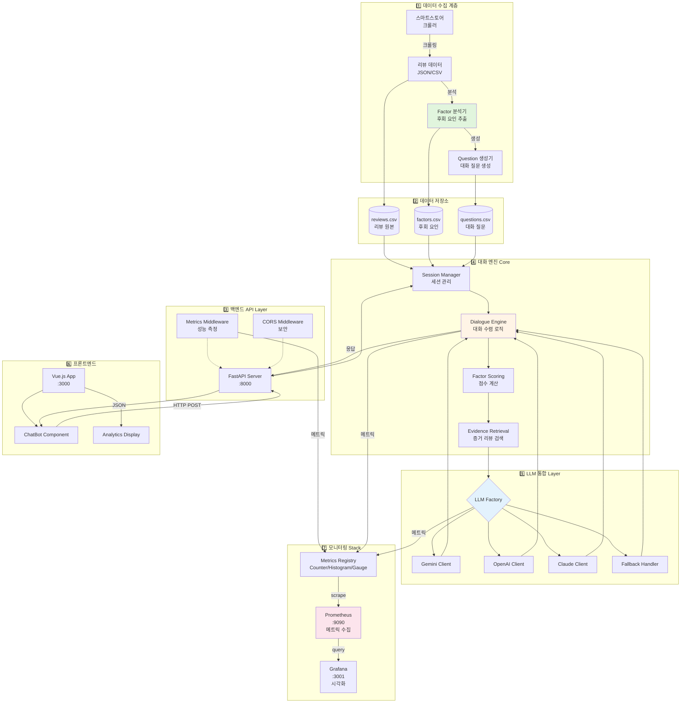

---

## 데이터 수집 계층

### 1. 리뷰 크롤링 및 수집

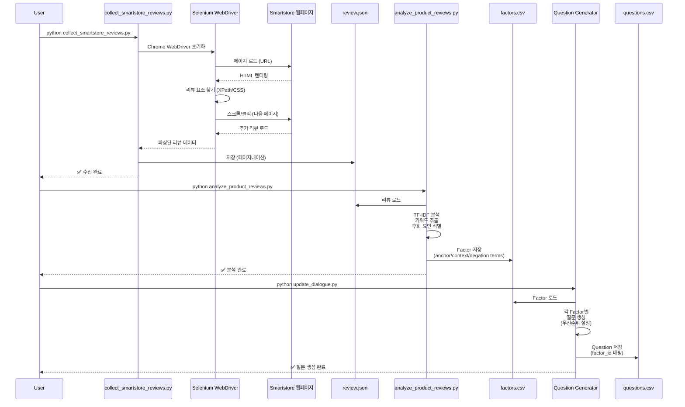

**주요 컴포넌트**:

- **`scripts/collect_smartstore_reviews.py`**
  - 역할: 네이버 스마트스토어 웹 스크래핑 (Selenium Chrome WebDriver)
  - 기능: 동적 페이지 로딩, 스크롤/클릭 자동화, 페이지네이션, 에러 처리, JSON/CSV 저장
  - 기술: Selenium WebDriver, undetected-chromedriver (선택적), XPath/CSS 선택자
  - 출력: `data/review/reviews_<product>_<timestamp>.json` 또는 `.csv`

- **`scripts/analyze_product_reviews.py`**
  - 역할: 리뷰 텍스트 분석 및 후회 요인 추출
  - 기술: TF-IDF, 키워드 빈도 분석
  - 출력: `data/factor/reg_factor.csv`

- **Factor 구조**:
  ```csv
  factor_id,category,factor_key,display_name,weight,anchor_terms,context_terms,negation_terms
  1,robot_cleaner,noise,소음,1.5,"소음|시끄러|떠들","조용|정숙","조용하|괜찮"
  ```
  - `factor_id`: 고유 식별자
  - `category`: 제품 카테고리 (예: robot_cleaner)
  - `factor_key`: Factor 키 (내부 참조용)
  - `display_name`: 화면 표시 이름
  - `weight`: 가중치 (점수 계산 시 곱셈)
  - `anchor_terms`: 핵심 키워드 (+1.0점)
  - `context_terms`: 연관 키워드 (+0.3점)
  - `negation_terms`: 부정/긍정 반전 표현 (점수 반영 X, `has_neg` 플래그만 설정하여 NEG/MIX/POS 증거 분류에 활용)

- **Question 구조**:
  ```csv
  question_id,factor_id,factor_key,question_text,answer_type,choices,next_factor_hint
  1001,1,water_control,물 양을 직접 조절하고 싶으신가요?,no_choice,,
  1002,1,water_control,커피 시 물 관리가 중요한가요?,single_choice,매우 중요|보통|상관없음,
  ```
  - `question_id`: 질문 고유 식별자
  - `factor_id`: 연결된 후회 요인 ID (factors.csv의 factor_id와 매핑)
  - `factor_key`: 후회 요인 키 (factors.csv의 factor_key와 매핑)
  - `question_text`: 사용자에게 표시되는 질문 텍스트
  - `answer_type`: 답변 유형 (`no_choice`, `single_choice`, `multi_choice` 등)
  - `choices`: 선택지 목록 (파이프 구분자 `|`, no_choice인 경우 빈 값)
  - `next_factor_hint`: 다음 질문 선택 힌트 (선택적)

### 2. 질문 생성

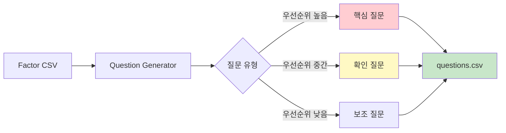

**Question 구조**:
```csv
question_id,factor_id,factor_key,question_text,answer_type,choices,next_factor_hint
1001,1,water_control,물 양을 직접 조절하고 싶으신가요?,no_choice,,
1002,1,water_control,커피 시 물 관리가 중요한가요?,single_choice,매우 중요|보통|상관없음,
```
- `question_id`: 질문 고유 식별자
- `factor_id`: 연결된 후회 요인 ID (factors.csv의 factor_id와 매핑)
- `factor_key`: 후회 요인 키 (factors.csv의 factor_key와 매핑)
- `question_text`: 사용자에게 표시되는 질문 텍스트
- `answer_type`: 답변 유형 (`no_choice`, `single_choice`, `multi_choice` 등)
- `choices`: 선택지 목록 (파이프 구분자 `|`, no_choice인 경우 빈 값)
- `next_factor_hint`: 다음 질문 선택 힌트 (선택적)

---

## 분석 파이프라인

### 1. 세션 초기화 및 데이터 로딩

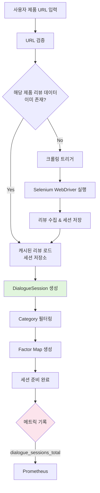

**주요 로직** (`backend/pipeline/dialogue.py`):

```python
class DialogueSession:
    def __init__(self, category, data_dir, reviews_df=None):
        # 1. 데이터 로드
        # - reviews_df: 세션 저장소에서 전달받은 리뷰 (운영)
        # - None: CSV에서 로드 (테스트/개발)
        self.reviews_df = reviews_df
        
        # 2. Factor/Question 파싱
        all_factors = parse_factors(factors_df)
        self.factors = [f for f in all_factors if f.category == category]
        self.questions = parse_questions(questions_df)
        
        # 3. 메트릭 기록
        dialogue_sessions_total.labels(category=category).inc()
```

### 2. 대화 턴 처리 (Factor Convergence)

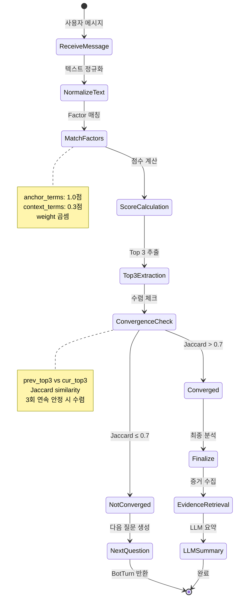

**핵심 알고리즘**:

```python
def step(self, user_message: str) -> BotTurn:
    # 1. 정규화 및 매칭
    norm = normalize(user_message)
    for factor in self.factors:
        score = 0
        if any(t in norm for t in factor.anchor_terms):
            score += 1.0
        if any(t in norm for t in factor.context_terms):
            score += 0.3
        
        weighted_score = score * factor.weight
        self.cumulative_scores[factor.factor_key] += weighted_score
    
    # 2. Top 3 추출
    top_factors = self._get_top_factors(top_k=3)
    
    # 3. 수렴 체크 (Jaccard similarity)
    jaccard = _jaccard(self.prev_top3, cur_top3)
    if jaccard > 0.7:
        self.stability_hits += 1
    
    # 4. 수렴 조건: 3회 연속 안정 OR 5턴 경과
    if self.stability_hits >= 3 or self.turn_count >= 5:
        return self._finalize(top_factors)
```

### 3. Evidence Retrieval (증거 리뷰 검색)

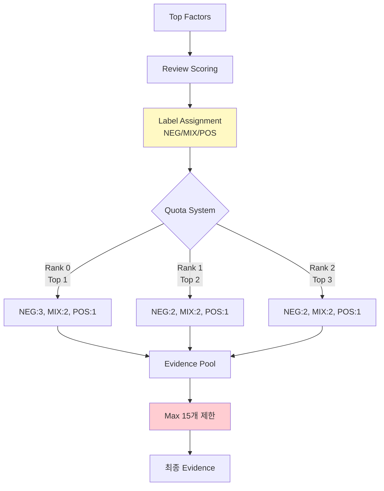

**Label 분류 로직** (`backend/pipeline/retrieval.py`):

```python
def _assign_label(row, factor_key):
    score = row.get(f"score_{factor_key}", 0)
    rating = row.get("rating", 5)
    
    # 1. 점수 기반
    if score >= 2.0 and rating <= 3:
        return "NEG"  # 강한 부정
    elif score >= 1.0 and rating == 4:
        return "MIX"  # 혼재
    elif score >= 1.0 and rating == 5:
        return "POS"  # 긍정
    else:
        return None  # 필터링
```

### 4. Scoring Pipeline

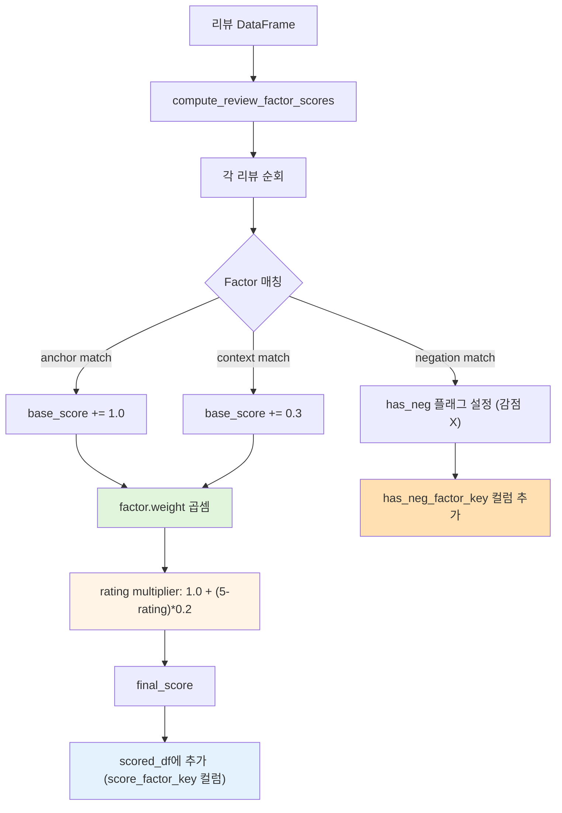

**메트릭 계측**:
```python
with Timer(scoring_duration_seconds, {'category': self.category}):
    self.scored_df, self.factor_counts = compute_review_factor_scores(
        self.reviews_df, 
        self.factors
    )
```

---

## 대화 엔진

### DialogueSession State Machine

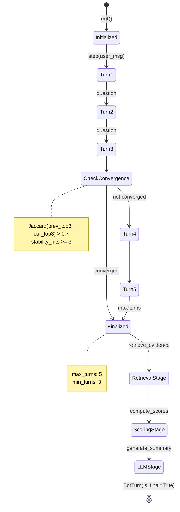

**세션 데이터 구조**:

```python
@dataclass
class BotTurn:
    question_text: Optional[str]        # 다음 질문
    top_factors: List[Tuple[str, float]]  # (factor_key, score)
    is_final: bool                       # 완료 여부
    llm_context: Optional[Dict]          # LLM 응답
    question_id: Optional[str]           # 질문 ID
    answer_type: Optional[str]           # no_choice | single_choice
    choices: Optional[str]               # 선택지
```

---

## LLM 통합

### LLM Factory Pattern

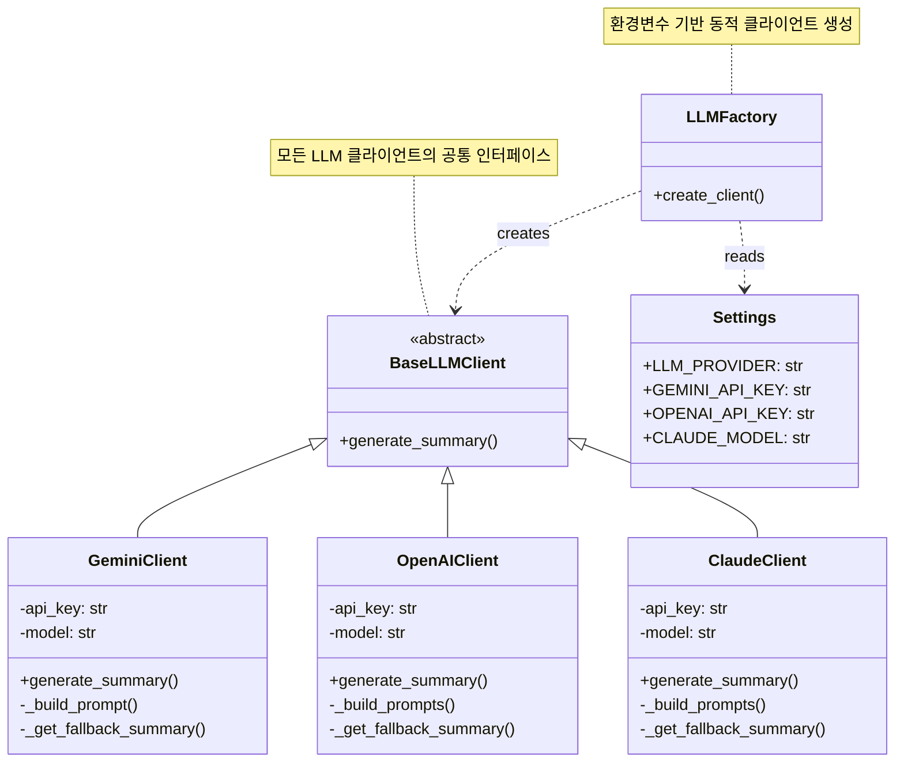

### LLM 호출 플로우

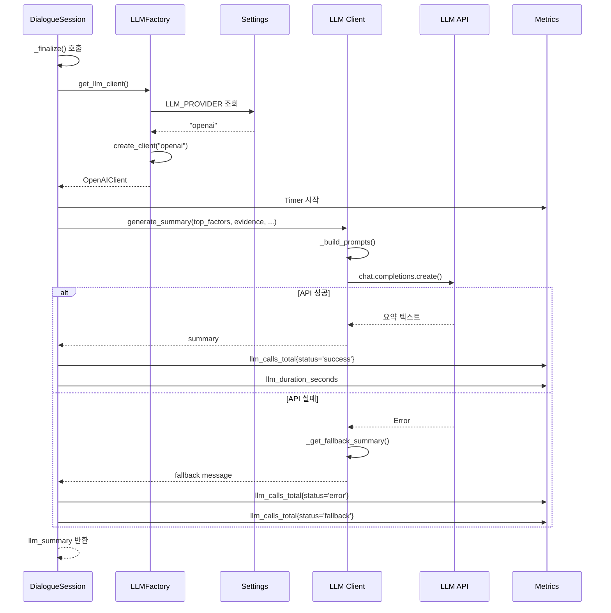

**프롬프트 구조**:

```python
# System Prompt
"""당신은 제품 리뷰 분석 전문가입니다.
구매 후회를 줄이기 위한 통찰을 제공하세요."""

# User Prompt
f"""
제품: {product_name} ({category_name})
대화 턴 수: {total_turns}

핵심 후회 요인 Top 5:
1. {factor1} (점수: {score1})
...

증거 리뷰 (부정적):
- "{review_text}" (평점: {rating})
...

다음 형식으로 요약하세요:
1. 핵심 후회 요인 설명 (2-3문장)
2. 구매 전 체크포인트 (3-5개)
3. 한 줄 조언
"""
```

---

## 모니터링 계층

### Metrics 수집 구조

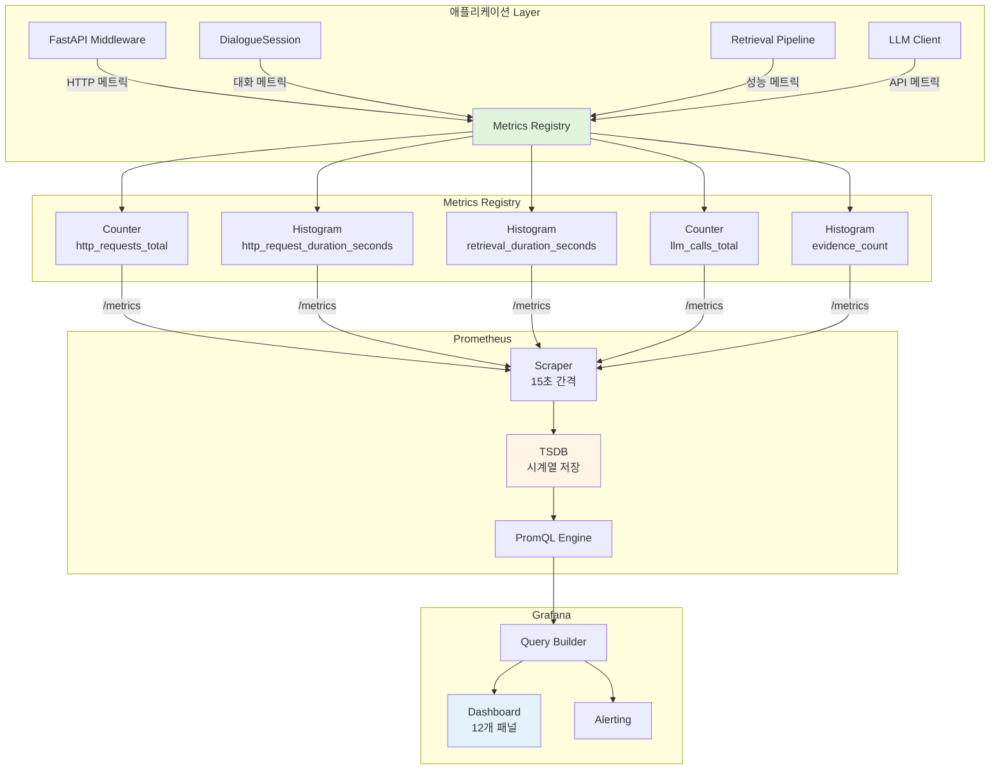

### 주요 메트릭 정의

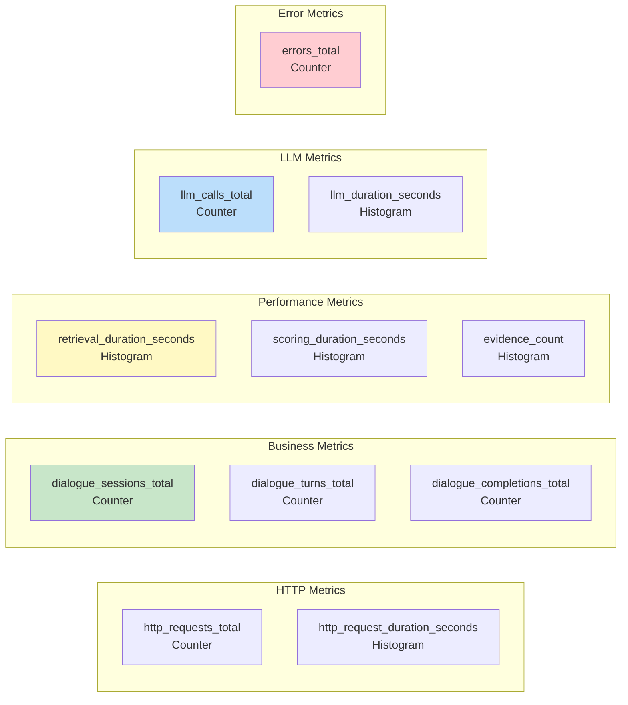

### 계측 포인트

```python
# 1. HTTP 요청 (미들웨어)
class MetricsMiddleware(BaseHTTPMiddleware):
    async def dispatch(self, request, call_next):
        start = time.time()
        response = await call_next(request)
        duration = time.time() - start
        
        http_requests_total.labels(
            method=request.method,
            endpoint=request.url.path,
            status_code=response.status_code
        ).inc()
        
        http_request_duration_seconds.labels(...).observe(duration)

# 2. 대화 단계
dialogue_sessions_total.labels(category=category).inc()
dialogue_turns_total.labels(category=category).inc()

# 3. 파이프라인 성능
with Timer(retrieval_duration_seconds, {'category': category}):
    evidence = retrieve_evidence_reviews(...)

# 4. LLM 호출
with Timer(llm_duration_seconds, {'provider': provider}):
    summary = llm_client.generate_summary(...)
llm_calls_total.labels(provider=provider, status='success').inc()
```

---

## 배포 아키텍처

### 환경별 배포 전략

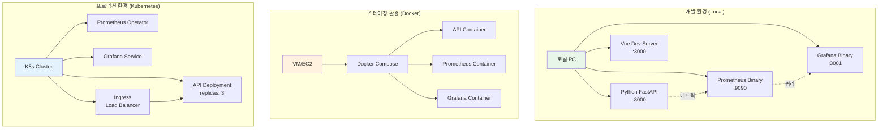

### 배포 플로우

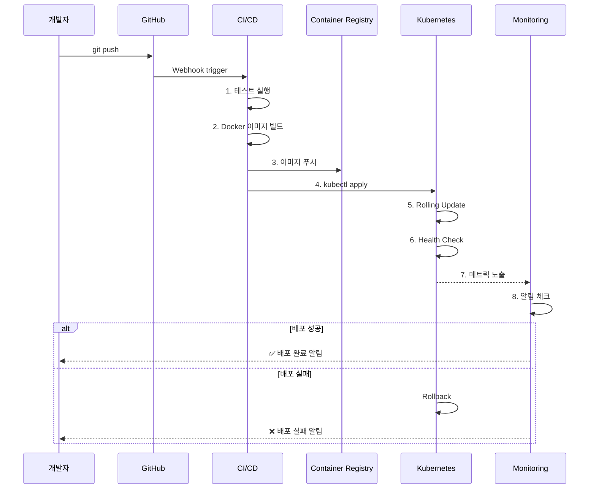

---

## 데이터 플로우 종합

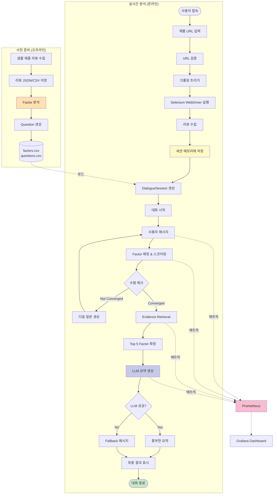

---

## 주요 컴포넌트 상세

### 1. 백엔드 API (`backend/app/`)

| 파일 | 역할 | 핵심 기능 |
|------|------|----------|
| `main.py` | FastAPI 애플리케이션 팩토리 | 미들웨어 등록, 라우터 설정, .env 로딩 |
| `api/routes_chat.py` | 대화 API 엔드포인트 | `/start`, `/message` 처리 |
| `api/routes_metrics.py` | 메트릭 노출 | `/metrics` Prometheus 형식 |

### 2. 파이프라인 (`backend/pipeline/`)

| 파일 | 역할 | 핵심 기능 |
|------|------|----------|
| `dialogue.py` | 대화 엔진 | 수렴 로직, 질문 생성, 최종 분석 |
| `sensor.py` | Factor 스코어링 | TF 매칭, weight 곱셈, rating multiplier |
| `retrieval.py` | Evidence 검색 | Label 분류 (NEG/MIX/POS), Quota 적용 |
| `reg_store.py` | 데이터 로딩 | CSV 파싱, Factor 객체 생성 |
| `ingest.py` | 텍스트 정규화 | 공백 제거, 소문자 변환 |

### 3. LLM 통합 (`backend/services/`)

| 파일 | 역할 | Provider |
|------|------|----------|
| `llm_base.py` | 추상 인터페이스 | - |
| `llm_gemini.py` | Google Gemini 클라이언트 | `gemini-1.5-flash` |
| `llm_openai.py` | OpenAI 클라이언트 | `gpt-4o-mini` |
| `llm_claude.py` | Anthropic Claude 클라이언트 | `claude-3-5-sonnet` |
| `llm_factory.py` | Factory 패턴 | 동적 클라이언트 생성 |

### 4. 모니터링 (`backend/core/`)

| 컴포넌트 | 유형 | 용도 |
|----------|------|------|
| `http_requests_total` | Counter | 요청 수 카운트 |
| `http_request_duration_seconds` | Histogram | Latency 분포 |
| `dialogue_sessions_total` | Counter | 세션 시작 수 |
| `retrieval_duration_seconds` | Histogram | Retrieval 성능 |
| `llm_calls_total` | Counter | LLM API 호출 (status별) |
| `evidence_count` | Histogram | Evidence 수 분포 |

### 5. 프론트엔드 (`frontend/src/`)

| 파일 | 역할 |
|------|------|
| `App.vue` | 루트 컴포넌트 |
| `components/ChatBot.vue` | 대화 UI, API 통신, 결과 표시 |
| `api.js` | Axios 기반 API 클라이언트 |
| `config.js` | 환경 설정 |

---

## 성능 최적화

### 1. 캐싱 전략

```python
class DialogueSession:
    def __init__(self):
        self.scored_df = None  # 캐시
        self.factor_counts = None  # 캐시
    
    def _finalize(self):
        # 첫 호출 시에만 계산, 이후 재사용
        if self.scored_df is None:
            self.scored_df, self.factor_counts = compute_scores(...)
```

### 2. 배치 처리

```python
# 한 번에 모든 리뷰 스코어 계산
scored_df = compute_review_factor_scores(reviews_df, factors)

# 개별 계산 대신 벡터화
df['score'] = df.apply(lambda row: score_function(row), axis=1)
```

### 3. 인덱싱

```python
# Factor map 생성 (O(1) 조회)
self.factors_map = {f.factor_key: f for f in self.factors}
self.factors_by_id = {f.factor_id: f for f in self.factors}
```

---

## 보안 고려사항

### 1. API Key 관리

```bash
# .env 파일 (Git 제외)
OPENAI_API_KEY=sk-...
GEMINI_API_KEY=...

# .gitignore
.env
*.key
*.pem
```

### 2. CORS 설정

```python
# backend/core/settings.py
ALLOWED_ORIGINS = [
    "http://localhost:3000",
    "https://yourdomain.com",
]
```

### 3. 데이터 격리

- 세션별 독립 DialogueSession 인스턴스
- 사용자 데이터 혼재 방지

---

## 확장 가능성

### 1. 새 제품 카테고리 추가

```bash
# 1. 리뷰 수집 (Selenium WebDriver 사용)
python scripts/collect_smartstore_reviews.py "https://brand.naver.com/..." \
    --category new_category \
    --product-name "product_name" \
    --max-reviews 100

# 2. Factor 분석
python scripts/analyze_product_reviews.py --category new_category

# 3. Question 생성 (수동 CSV 작성)
# data/question/reg_question.csv에 추가
```

### 2. 새 LLM Provider 추가

```python
# 1. 클라이언트 구현
class NewLLMClient(BaseLLMClient):
    def generate_summary(self, ...):
        # API 호출 로직
        pass

# 2. Factory에 등록
class LLMFactory:
    @staticmethod
    def create_client(provider, ...):
        if provider == "newllm":
            return NewLLMClient(...)
```

### 3. 다국어 지원

```python
# 1. 언어별 정규화 함수
def normalize(text, lang='ko'):
    if lang == 'ko':
        # 한글 처리
    elif lang == 'en':
        # 영어 처리

# 2. 언어별 Factor/Question
# data/factor/reg_factor_en.csv
```

---

## 기술 스택 요약

| 계층 | 기술 | 버전 |
|------|------|------|
| **백엔드** | FastAPI | 0.115.0 |
| | Python | 3.11+ |
| | Pandas | 2.3.3 |
| | Uvicorn | 0.32.0 |
| **프론트엔드** | Vue.js | 3.x |
| | Vite | 5.x |
| | Axios | 1.x |
| **LLM** | OpenAI | gpt-4o-mini |
| | Google Gemini | gemini-1.5-flash |
| | Anthropic Claude | claude-3-5-sonnet |
| **모니터링** | Prometheus | 2.48.1 |
| | Grafana | 10.2.3 |
| | prometheus-client | 0.20.0+ |
| **배포** | Docker | 24.x |
| | Docker Compose | 2.x |
| | Kubernetes | 1.28+ (선택) |

---

## 참고 문서

- [README.md](README.md) - 프로젝트 개요
- [MONITORING.md](MONITORING.md) - 모니터링 상세 가이드
- [DEPLOYMENT_MONITORING.md](DEPLOYMENT_MONITORING.md) - 배포 전략
- [LLM_SETUP.md](LLM_SETUP.md) - LLM 설정 가이드
- [SMARTSTORE_REVIEW_COLLECTION.md](SMARTSTORE_REVIEW_COLLECTION.md) - 크롤링 가이드
- [ARCHITECTURE_OLD.md](ARCHITECTURE_OLD.md) - 이전 아키텍처 문서 (참고용)

---

**문서 버전**: 2.0  
**최종 업데이트**: 2026-01-04  
**작성자**: ReviewLens Team
