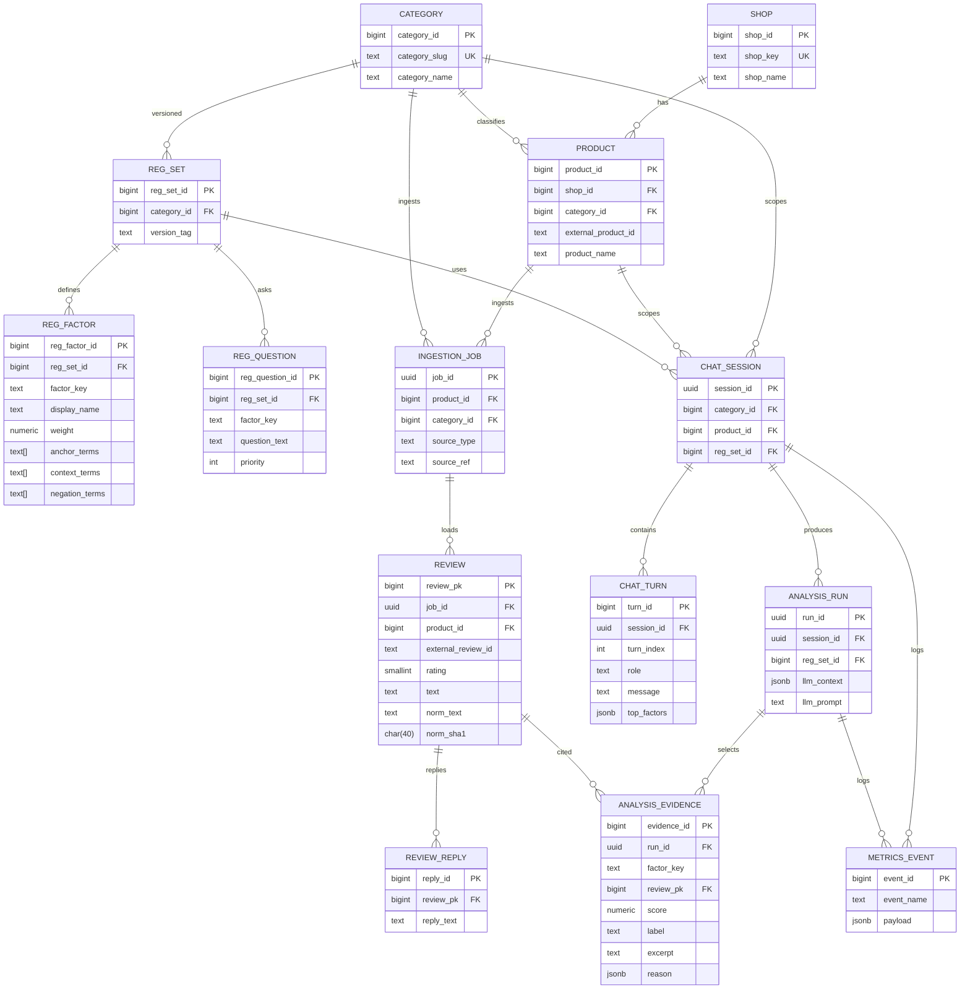

# ReviewLens ERD (mermaid)

```mermaid
erDiagram
  SHOP ||--o{ PRODUCT : has
  CATEGORY ||--o{ PRODUCT : classifies

  CATEGORY ||--o{ REG_SET : versioned
  REG_SET ||--o{ REG_FACTOR : defines
  REG_SET ||--o{ REG_QUESTION : asks

  PRODUCT ||--o{ INGESTION_JOB : ingests
  CATEGORY ||--o{ INGESTION_JOB : ingests
  INGESTION_JOB ||--o{ REVIEW : loads
  REVIEW ||--o{ REVIEW_REPLY : replies

  CATEGORY ||--o{ CHAT_SESSION : scopes
  PRODUCT ||--o{ CHAT_SESSION : scopes
  REG_SET ||--o{ CHAT_SESSION : uses
  CHAT_SESSION ||--o{ CHAT_TURN : contains
  CHAT_SESSION ||--o{ ANALYSIS_RUN : produces
  ANALYSIS_RUN ||--o{ ANALYSIS_EVIDENCE : selects
  REVIEW ||--o{ ANALYSIS_EVIDENCE : cited

  CHAT_SESSION ||--o{ METRICS_EVENT : logs
  ANALYSIS_RUN ||--o{ METRICS_EVENT : logs

  SHOP {
    bigint shop_id PK
    text shop_key UK
    text shop_name
  }
  CATEGORY {
    bigint category_id PK
    text category_slug UK
    text category_name
  }
  PRODUCT {
    bigint product_id PK
    bigint shop_id FK
    bigint category_id FK
    text external_product_id
    text product_name
  }
  REG_SET {
    bigint reg_set_id PK
    bigint category_id FK
    text version_tag
  }
  REG_FACTOR {
    bigint reg_factor_id PK
    bigint reg_set_id FK
    text factor_key
    text display_name
    numeric weight
    text[] anchor_terms
    text[] context_terms
    text[] negation_terms
  }
  REG_QUESTION {
    bigint reg_question_id PK
    bigint reg_set_id FK
    text factor_key
    text question_text
    int priority
  }
  INGESTION_JOB {
    uuid job_id PK
    bigint product_id FK
    bigint category_id FK
    text source_type
    text source_ref
  }
  REVIEW {
    bigint review_pk PK
    uuid job_id FK
    bigint product_id FK
    text external_review_id
    smallint rating
    text text
    text norm_text
    char(40) norm_sha1
  }
  REVIEW_REPLY {
    bigint reply_id PK
    bigint review_pk FK
    text reply_text
  }
  CHAT_SESSION {
    uuid session_id PK
    bigint category_id FK
    bigint product_id FK
    bigint reg_set_id FK
  }
  CHAT_TURN {
    bigint turn_id PK
    uuid session_id FK
    int turn_index
    text role
    text message
    jsonb top_factors
  }
  ANALYSIS_RUN {
    uuid run_id PK
    uuid session_id FK
    bigint reg_set_id FK
    jsonb llm_context
    text llm_prompt
  }
  ANALYSIS_EVIDENCE {
    bigint evidence_id PK
    uuid run_id FK
    text factor_key
    bigint review_pk FK
    numeric score
    text label
    text excerpt
    jsonb reason
  }
  METRICS_EVENT {
    bigint event_id PK
    text event_name
    jsonb payload
  }
```
